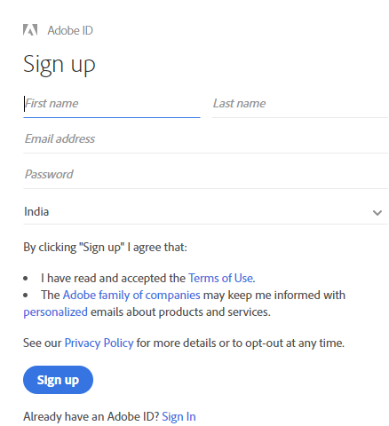
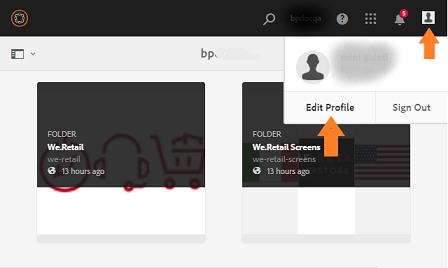

# Experience Manager Assets Brand Portal の概要 {#overview-of-aem-assets-brand-portal}

マーケターは、関連するデジタルコンテンツの作成、管理および顧客への配信をすばやく行うために、チャネルパートナーや内部のビジネスユーザーとの連携が必要となる場合があります。関連するコンテンツをカスタマージャーニー全体にわたってタイミングよく配信することは、顧客のニーズやコンバージョン、エンゲージメント、ロイヤリティを促進するために不可欠です。

しかし問題は、広範囲に広がる内部チームやパートナー、リセラーとの間でブランドロゴやガイドライン、キャンペーンアセット、製品の写真を効率的かつ安全に共有できるソリューションを構築するのは容易ではないということです。

**Adobe Experience Manager（AEM）Assets Brand Portal** は、アセット配布およびアセット投稿機能を提供することで、世界中に分散している Brand Portal ユーザーと効果的に共同作業を行うマーケターのニーズに注力しています。

アセット配布により、承認されたクリエイティブアセットを容易に取得、制御し、それらのアセットを、様々なデバイスをまたいで、外部の関係者や内部のビジネスユーザーに安全に配布できます。一方、アセット投稿により、Brand Portal ユーザーは、オーサー環境にアクセスすることなく、Brand Portal にアセットをアップロードしたり、Experience Manager Assets に公開したりできます。投稿機能は、**Brand Portal でのアセットソーシング**と呼ばれます。これらにより、Brand Portal ユーザー（外部の代理店／チーム）からのアセット配布および投稿の全体的な Brand Portal エクスペリエンスを向上させ、アセットの市場投入までの時間を短縮し、コンプライアンス違反や不正アクセスのリスクを低減できます。
[Brand Portal でのアセットソーシング](brand-portal-asset-sourcing.md)を参照してください。

ブラウザーベースのポータル環境では、アセットを簡単にアップロード、参照、検索、プレビュー、承認された形式で書き出すことができます。

## Experience Manager Assets と Brand Portal の連携の設定 {#configure-brand-portal}

Adobe Experience Manager Assets と Brand Portal の連携を設定すると、Brand Portal ユーザー向けにアセットの公開、アセットの配布、アセットの投稿機能が可能になります。

>[!NOTE]
>
>Experience Manager Assets と Brand Portal の連携の設定は、Experience Manager Assets as a Cloud Service および Experience Manager Assets 6.3 以降でサポートされています。

Cloud Manager から Brand Portal をアクティベートすると、Experience Manager Assets as a Cloud Service と Brand Portal の連携が自動的に設定されます。アクティベーションワークフローにより、バックエンドで必要な設定が作成され、Experience Manager Assets as a Cloud Service インスタンスと同じ IMS 組織に Brand Portal がアクティベートされます。

一方、Experience Manager Assets（オンプレミス版および Managed Services 版）と Brand Portal の連携は、Adobe Developer Console を使用して手動で設定されます。このコンソールでは、Brand Portal テナントの認証に使用する Adobe Identity Management サービス（IMS）トークンを調達します。

詳しくは、[Experience Manager Assets と Brand Portal の連携の設定](../using/configure-aem-assets-with-brand-portal.md)を参照してください。

## Brand Portal でのユーザーのペルソナ {#Personas}

Brand Portal では次のユーザー役割をサポートしています。

* ゲストユーザー
* 閲覧者
* 編集者
* 管理者

次の表に、これらの役割を持つユーザーが実行できるタスクを示します。

|  | **参照** | **検索** | **ダウンロード** | **フォルダーの共有** | **コレクションの共有** | **アセットをリンクとして共有** | **管理ツールにアクセス** |
|--- |--- |--- |--- |--- |--- |--- |--- |
| **ゲストユーザー** | ✓* | ✓* | ✓* | x | x | x | x |
| **閲覧者** | ✓ | ✓ | ✓ | x | x | x | x |
| **編集者** | ✓ | ✓ | ✓ | ✓ | ✓ | ✓ | x |
| **管理者** | ✓ | ✓ | ✓ | ✓ | ✓ | ✓ | ✓ |

>[!NOTE]
>
>ゲストユーザーは、公開フォルダーおよび公開コレクション内にあるアセットのみを参照、アクセス、および検索できます。

<!--
&#42; Viewer users can access and download the public assets shared with them, and can add these assets to create their own collections.

>[!NOTE]
>
>There is a known issue that the share link for collections is currently visible to the viewer users. The viewer users does not have the privilege to add users to create a share link. This issue will be fixed in the upcoming release, the option to share link for the collections will not be available to the viewer users.
-->

### ゲストユーザー {#guest-user}

Experience Manager Assets Brand Portal では、Brand Portal への[ゲストによるアクセス](#request-access-to-brand-portal)を許可します。ゲストユーザーは資格情報がなくてもポータルに入ることができ、公開フォルダー（およびコレクション）にアクセスできます。ゲストユーザーは、アセットの詳細を参照したり、公開フォルダーおよび公開コレクションのメンバーのアセットの完全なアセット表示を行ったりできます。公開アセットを検索、ダウンロード、および [!UICONTROL Lightbox] コレクションに追加できます。

ただし、ゲストセッションでは、コレクションや保存済みの検索結果を作成したり、それらを共有したりすることはできません。ゲストセッション中のユーザーはフォルダーやコレクションの設定にアクセスしたり、アセットをリンクとして共有したりすることはできません。次に、ゲストユーザーが実行できるタスクの一覧を示します。

* [公開アセットの参照および公開アセットへのアクセス](browse-assets-brand-portal.md)

* [公開アセットの検索](brand-portal-searching.md)

* [公開アセットのダウンロード](brand-portal-download-assets.md)

* [[!UICONTROL Lightbox] へのアセットの追加](brand-portal-light-box.md#add-assets-to-lightbox)

詳しくは、[Brand Portal へのゲストによるアクセス](../using/guest-access.md)を参照してください。

### 閲覧者 {#viewer}

[!DNL Admin Console] で定義され閲覧者の役割で Brand Portal にアクセスできる Brand Portal ユーザーです。この役割を持つユーザーは、Brand Portal にログインし、許可されたフォルダー、コレクション、アセットにアクセスできます。また、アセット（元のアセットまたは特定のレンディション）を参照、プレビュー、ダウンロードおよび書き出したり、アカウント設定を指定したり、アセットを検索したりすることもできます。次に、閲覧者が実行できるタスクの一覧を示します。

* [アセットの参照](browse-assets-brand-portal.md)

* [アセットの検索](brand-portal-searching.md)

* [アセットのダウンロード](brand-portal-download-assets.md)

### 編集者 {#editor}

編集者の役割を持つユーザーは、閲覧者が実行できるタスクをすべて実行できます。さらに、編集者は、管理者によって共有されたファイルとフォルダーを表示できます。また、編集者の役割を持つユーザーは、コンテンツ（ファイル、フォルダー、コレクション）を他のユーザーと共有することもできます。

編集者は、閲覧者が実行できるタスクに加えて、次のタスクを実行できます。

* [フォルダーの共有](brand-portal-sharing-folders.md)

* [コレクションの共有](brand-portal-share-collection.md)

* [アセットをリンクとして共有](brand-portal-link-share.md)

### 管理者 {#administrator}

管理者には、[!UICONTROL Admin Console] でシステム管理者または Brand Portal 製品管理者としてマーキングされているユーザーが含まれます。管理者は、システム管理者とユーザーを追加／削除したり、プリセットを定義したりできます。また、ユーザーにメールを送信したり、ポータルの使用状況とストレージに関するレポートを表示したりできます。

>[!NOTE]
>
>Brand Portal では、[!UICONTROL Admin Console] でのサポート管理者の役割とマークが付けられているユーザーは、システム管理者と同じ権限を持っています。

管理者は、編集者が実行可能なすべてのタスクを実行できます。管理者が実行できるその他のタスクを次に示します。

* [ユーザー、グループ、ユーザーの役割の管理](brand-portal-adding-users.md)

* [壁紙、ページヘッダーおよびメールのカスタマイズ](brand-portal-branding.md)

* [カスタム検索ファセットの使用](brand-portal-search-facets.md)

* [メタデータスキーマフォームの使用](brand-portal-metadata-schemas.md)

* [画像プリセットまたは動的レンディションの適用](brand-portal-image-presets.md)

* [レポートの操作](brand-portal-reports.md)

AEM Assets の作成者は、上記のタスクに加えて、次のタスクを実行できます。

* [AEM Assets と Brand Portal の連携の設定](../using/configure-aem-assets-with-brand-portal.md)

* [Brand Portal へのフォルダーの公開](https://experienceleague.adobe.com/docs/experience-manager-65/assets/brandportal/brand-portal-publish-folder.html?lang=ja)

* [Brand Portal へのコレクションの公開](https://experienceleague.adobe.com/docs/experience-manager-65/assets/brandportal/brand-portal-publish-collection.html?lang=ja)

## Brand Portal URL の代替エイリアス {#tenant-alias-for-portal-url}

Brand Portal 6.4.3 以降では、各組織はそれぞれの Brand Portal テナントの既存 URL に対して 1 つの代替（エイリアス）URL を持つことができます。エイリアス URL を作成するには、既存の URL に代替プレフィックスを含めます。\
テナント名が 32 文字を超える場合は、テナントのエイリアスを作成する必要があります。
カスタマイズできるのは Brand Portal URL のプレフィックスのみであり、URL 全体でないことに注意してください。例えば、`geomettrix.brand-portal.adobe.com` という既存ドメインを持つ組織は、アドビに依頼することで `geomettrixinc.brand-portal.adobe.com` という URL を作成できます。

ただし、AEM オーサーインスタンスを[設定](../using/configure-aem-assets-with-brand-portal.md)する際にはテナント ID URL のみを使用できます。テナントエイリアス（代替）URL は使用できません。

>[!NOTE]
>
>既存のポータル URL 中のテナント名のエイリアスを取得するには、各組織からカスタマーサポートへ新規テナント名の作成依頼を出す必要があります。このリクエストが処理される際は、まずそのエイリアスが使用可能かどうかの確認が行われ、その後でエイリアスが作成されます。
>
>古いエイリアスを置き換えたり、削除したりするには、同じ手続きに従う必要があります。

## Brand Portal へのアクセス権の申請 {#request-access-to-brand-portal}

ユーザーは、Brand Portal へのアクセス権をログイン画面から申請できます。この申請は Brand Portal 管理者に送信され、この管理者が Adobe [!UICONTROL Admin Console] を通じてユーザーにアクセス権を付与します。アクセス権が付与されると、ユーザーに通知メールが届きます。

アクセス権を申請するには、以下の手順を実行します。

1. Brand Portal ログインページから、「**[!UICONTROL アクセスが必要ですか？]**」の横にある「**[!UICONTROL ここをクリックしてください]**」を選択します。ただし、ゲストセッションに入るには、「**[!UICONTROL ゲストとしてアクセスしますか？]**」の横にある「**[!UICONTROL ここをクリックしてください]**」を選択します。

   

   [!UICONTROL アクセスを申請]ページが開きます。

1. 組織の Brand Portal へのアクセスを申請するには、有効な [!UICONTROL Adobe ID]、[!UICONTROL Enterprise ID] または [!UICONTROL Federated ID] を持っている必要があります。

   [!UICONTROL アクセスを申請]ページで、自分の ID を使用してログインするか（シナリオ 1）、[!UICONTROL Adobe ID] を作成します（シナリオ 2）。

   ![[!UICONTROL アクセスの申請]](assets/bplogin_request_access_2.png)

   **シナリオ 1**

   1. [!UICONTROL Adobe ID]、[!UICONTROL Enterprise ID] または [!UICONTROL Federated ID] を持っている場合は、「**[!UICONTROL ログイン]**」をクリックします。
[!UICONTROL ログイン]ページが開きます。

   1. [!UICONTROL Adobe ID] 資格情報を入力し、「**[!UICONTROL ログイン]**」をクリックします。

      

   [!UICONTROL アクセスを申請]ページにリダイレクトされます。

   **シナリオ 2**

   1. [!UICONTROL Adobe ID] を持っていない場合は、[!UICONTROL アクセスを申請]ページの「**[!UICONTROL Adobe ID を取得]**」をクリックして、Adobe ID を作成します。
[!UICONTROL ログイン]ページが開きます。
   1. 「**[!UICONTROL Adobe ID を取得]**」をクリックします。
[!UICONTROL 新規登録]ページが開きます。
   1. 名前、メール ID およびパスワードを入力します。
   1. 「**[!UICONTROL 新規登録]**」をクリックします。

      

   [!UICONTROL アクセスを申請]ページにリダイレクトされます。

1. アクセスの申請に使用する現在のユーザーの名前とメール ID が次のページに表示されます。管理者のコメントは空欄のまま、「**[!UICONTROL 送信]**」をクリックします。

   

## 製品管理者によるアクセス権の付与 {#grant-access-to-brand-portal}

Brand Portal 製品管理者は Brand Portal の通知領域および自分のインボックス内のメールでアクセス申請を受け取ります。

製品管理者がアクセス権を付与するには、Brand Portal の通知領域に届いた通知をクリックし、「**[!UICONTROL アクセス権を付与]**」をクリックする必要があります。
または、アクセス申請メールに記載されているリンクをたどって Adobe [!UICONTROL Admin Console] にアクセスし、該当する製品設定にユーザーを追加することもできます。

[Adobe [!UICONTROL Admin Console]](https://adminconsole.adobe.com/enterprise/overview) ホームページにリダイレクトされます。Adobe [!UICONTROL Admin Console] を使用してユーザーを作成し、そのユーザーを、Brand Portal にグループとして表示される製品プロファイル（旧称：製品設定）に割り当てます。[!UICONTROL Admin Console] でのユーザーの追加について詳しくは、[ユーザーの追加](brand-portal-adding-users.md#add-a-user)を参照してください（手順 4～7 に従って、ユーザーを追加します）。

## Brand Portal の言語 {#brand-portal-language}

Brand Portal の言語は、Adobe [!UICONTROL Experience Cloud 設定]で変更できます。

言語を変更するには：

1. 上部メニューから、[!UICONTROL ユーザー]／[!UICONTROL プロファイルを編集]を選択します。

   

1. [!UICONTROL Experience Cloud 設定]ページで、[!UICONTROL 言語]ドロップダウンメニューから言語を選択します。

## Brand Portal のメンテナンス通知 {#brand-portal-maintenance-notification}

Brand Portal のメンテナンスのために停止が予定されている場合は、Brand Portal にログインすると、バナー通知が表示されます。以下に通知の例を示します。

この通知を解除すると、Brand Portal を引き続き使用できます。この通知は、新しいセッションのたびに表示されます。

## リリースおよびシステム情報 {#release-and-system-information}

* [新機能](whats-new.md)
* [リリースノート](brand-portal-release-notes.md)
* [サポートされているファイル形式](brand-portal-supported-formats.md)

## 関連リソース {#related-resources}

<!--
* [Adobe Customer Support]()
-->

* [AEM フォーラム](https://experienceleaguecommunities.adobe.com/t5/adobe-experience-manager/ct-p/adobe-experience-manager-community)
