# Brand Portal でアセットを参照する {#browsing-assets-on-brand-portal}

Experience Manager Assets Brand Portalには、様々な表示オプションを使用しながらリソースの参照、アセット階層のトラバース、およびアセットの検索を容易におこなえる様々な機能とユーザーインターフェイス要素が用意されています。

Experience Manager上部のツールバーにあるツールロゴを使用すると、管理者ユーザーは管理ツールパネルにアクセスできます。

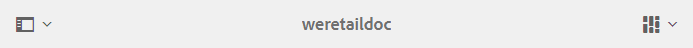 

Brand Portal ドロップダウンの左上にあるパネルセレクターを使用すると、アセット階層へ移動、検索を効率化、およびリソースを表示するオプションが表示されます。

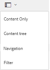

Brand Portal の右上にある表示セレクターで利用可能な表示（カード、列、およびリスト）のいずれかを使用すると、アセットを表示、ナビゲーション、および選択することができます。

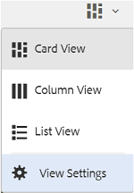

## リソースの表示と選択 {#viewing-and-selecting-resources}

概念上、表示、ナビゲーションおよび選択はすべての表示で同じ操作ですが、使用している表示によって処理がわずかに異なります。

使用可能な任意の表示方法で、リソースを表示、ナビゲーションおよび（追加のアクションをおこなうために）選択できます。

* 列表示
* カード表示
* リスト表示

### カード表示

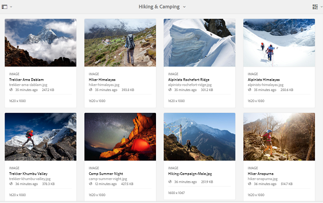

カード表示では、現在のレベルの各項目の情報カードを表示します。これらのカードは、以下の詳細が記載されています。

* アセット／フォルダーの内容を視覚的に表現したもの。
* 種類
* タイトル
* 名前
* AEM から Brand Portal にアセットが公開された日付と時刻
* サイズ
* ディメンション寸法

カードを（クイックアクションを回避するために慎重に）タップまたはクリックして階層の下に移動したり、[ヘッダーのパンくずリスト](https://experienceleague.adobe.com/docs/experience-manager-65/authoring/essentials/basic-handling.html)を使用して再び上に移動したりできます。

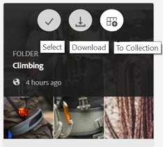

#### 管理者以外のユーザー向けカード表示

カード表示のフォルダーのカードは、管理者以外のユーザー（編集者、閲覧者、およびゲストユーザー）にフォルダー階層情報を表示します。この機能は、親階層について、アクセスしようとしているフォルダーの場所をユーザーに知らせます。フォルダー階層情報は特に、似たような名前のフォルダーを、別のフォルダー階層から共有された他のフォルダーと区別する際に便利です。管理者以外のユーザーが、自分たちに共有されているアセットのフォルダー構造を把握していない場合、似たような名前のアセット／フォルダーは紛らわしくなります。

* それぞれのカードに表示されるパスは、カードのサイズに合わせて切り詰めて表示されます。ただし、ユーザーが切り詰められたパスにカーソルを合わせると、完全なパスをツールヒントとして表示することができます。

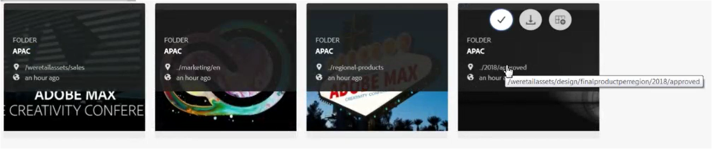

**アセットのプロパティを表示する「概要」オプション**

「概要」オプションでは、管理者以外のユーザー（編集者、閲覧者、ゲストユーザー）が、選択したアセット／フォルダーのアセットのプロパティを表示できます。「概要」オプションは、次の場所に表示されます。

* アセットやフォルダーを選択する際に上部に表示されるツールバー。
* パネルセレクターを選択する際のドロップダウン。

アセットやフォルダーを選択した状態で「**[!UICONTROL 概要]**」オプションを選択すると、タイトル、パス、アセット作成時間を確認できます。一方、アセットの詳細ページで「概要」オプションを選択すると、アセットのメタデータを確認できます。

#### カード表示の表示設定

表示セレクターで&#x200B;**[!UICONTROL 表示設定]**&#x200B;を選択すると、**[!UICONTROL 表示設定]**&#x200B;ダイアログが開き、カード表示でアセットのサムネールをサイズ変更できます。これにより、表示をパーソナライズして、表示されるサムネールの数を制御できます。

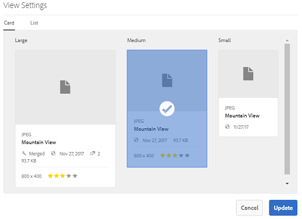

### リスト表示

リスト表示では、現在のレベルの各リソースの情報が表示されます。リスト表示は次の詳細を提供します。

* アセットのサムネール画像
* 名前
* タイトル
* ロケール
* 種類
* ディメンション
* サイズ
* 評価
* アセット階層画像を示すフォルダーパス *
* Brand Portal 上のアセットの公開日

パス列を使用すると、フォルダー階層内のアセットの場所が特定しやすくなります。リソース名をタップまたはクリックして階層の下に移動したり、[ヘッダーのパンくずリスト](https://experienceleague.adobe.com/docs/experience-manager-65/authoring/essentials/basic-handling.html)を使用して上に戻ったりできます。

<!--
Comment Type: draft lastmodifiedby="mgulati" lastmodifieddate="2018-08-17T03:12:05.096-0400" type="annotation">Removed:- "Selecting assets in list view To select all items in the list, use the checkbox at the upper left of the list. When all items in the list are selected, this check box appears checked. To deselect all, click or tap the checkbox. When only some items are selected, it appears with a minus sign. To select all, click or tap the checkbox. To deselect all, click or tap the checkbox again. You can change the order of items using the dotted vertical bar at the far right of each item in the list. Tap/click the vertical selection bar and drag the item to a new position in the list."
 -->

### リスト表示の表示設定

リスト表示の最初の列には、デフォルトでアセットの&#x200B;**[!UICONTROL 名前]**&#x200B;が表示されます。アセットの&#x200B;**[!UICONTROL タイトル]**、**[!UICONTROL ロケール]**、**[!UICONTROL タイプ]**、**[!UICONTROL ディメンション]**、**[!UICONTROL サイズ]**、**[!UICONTROL レーティング]**、公開状態などの追加情報も表示されます。ただし、「**[!UICONTROL 表示設定]**」を使用して、表示する列を選択することもできます。

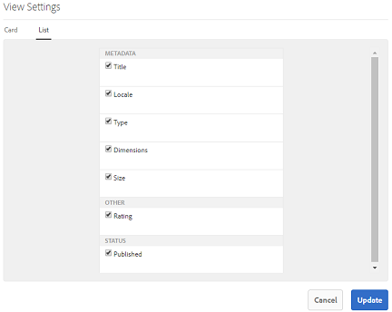

### 列表示

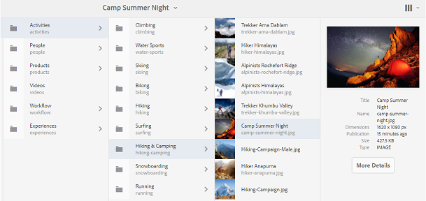

列表示を使用すると、一連のカスケード列からコンテンツツリー内を移動できます。この表示は、アセット階層を視覚化およびトラバースするのに便利です。

最初（一番左）の列のリソースを選択すると、右側にある 2 列目に子リソースが表示されます。2 列目のリソースを選択すると、右側にある 3 列目に子リソースが表示されます（以降も同様です）。

リソース名かリソース名の右にある山形記号をタップまたはクリックすることで、ツリーを上下に移動できます。

* タップまたはクリックするとリソース名と山形記号がハイライト表示されます。
* サムネールをタップまたはクリックして、リソースを選択します。
* すると、チェックマークがサムネールにオーバーレイ表示され、リソース名もハイライト表示されます。
* 選択されたリソースの詳細が最後の列に表示されます。

列表示でアセットが選択されると、アセットを視覚的に表現したものが次の詳細と共に最後の列に表示されます。

* タイトル
* 名前
* ディメンション寸法
* AEM から Brand Portal にアセットが公開された日付と時刻
* サイズ
* 種類
* 詳細オプション（アセットの詳細ページへ移動する）

<!--
Comment Type: draft

<h3>Selecting Resources</h3>
-->

<!--
Comment Type: draft

Selecting a specific resource depends on a combination of the view and the device:

-->

<!--
Comment Type: draft

<table border="1" cellpadding="1" cellspacing="0" width="100%">
<tbody>
<tr>
<td> </td>
<td>Select</td>
<td>Deselect</td>
</tr>
<tr>
<td>Column View  </td>
<td>
<ul>
<li>Desktop:  Mouseover, then use the check mark quick action</li>
<li>Mobile device:  Tap the thumbnail</li>
</ul> </td>
<td>
<ul>
<li>Desktop:  Click the thumbnail</li>
<li>Mobile device:  Tap the thumbnail</li>
</ul> </td>
</tr>
<tr>
<td>Card View  </td>
<td>
<ul>
<li>Desktop:  Mouseover, then use the check mark quick action</li>
<li>Mobile device:  Tap-and-hold the card</li>
</ul> </td>
<td>
<ul>
<li>Desktop:  Click the card</li>
<li>Mobile device:  Tap the card</li>
</ul> </td>
</tr>
<tr>
<td>List View</td>
<td>
<ul>
<li>Desktop:  Mouseover, then use the check mark quick action</li>
<li>Mobile device:  Tap the thumbnail</li>
</ul> </td>
<td>
<ul>
<li>Desktop:  Click the thumbnail</li>
<li>Mobile device:  Tap the thumbnail</li>
</ul> </td>
</tr>
</tbody>
</table>
-->

<!--
Comment Type: draft

Deselecting All
-->

<!--
Comment Type: draft

In all cases, as you select items the count of the items selected is displayed at the upper right of the toolbar.

You can deselect all items and exit selection mode by clicking or tapping the X next to the count.

-->

<!--
Comment Type: draft

In all views, all items can be deselected by tapping escape on the keyboard if you are using a desktop device.

-->

## コンテンツツリー {#content-tree}

これらの表示に加え、3 つのツリー表示を使用して、目的のアセットやフォルダーを表示および選択しながらアセット階層をドリルダウンします。

ツリー表示を開くには、左上のパネルセレクターをタップまたはクリックし、メニューから「**[!UICONTROL コンテンツツリー]**」を選択します。

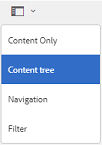

コンテンツ階層から目的のアセットに移動します。

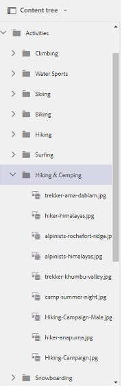

## アセットの詳細 {#asset-details}

アセットの詳細ページでは、アセットを表示、ダウンロード、アセットリンクを共有、コレクションへアセットを移動させる、またはアセットのプロパティページを表示することができます。また、同じフォルダーの他のアセットの詳細ページへ続けて移動することもできます。

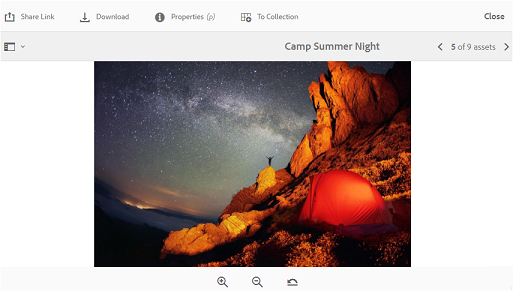

アセットのメタデータや様々なレンディションを表示するには、アセットの詳細ページのパネルセレクターを使用します。

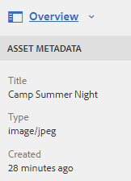

アセットの詳細ページでアセットの利用可能なレンディションをすべて表示し、レンディションを選択してプレビューできます。

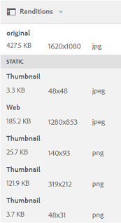

アセットプロパティページを開くには、上部のバーにある「**[!UICONTROL プロパティ (p)]**」オプションを使用します。

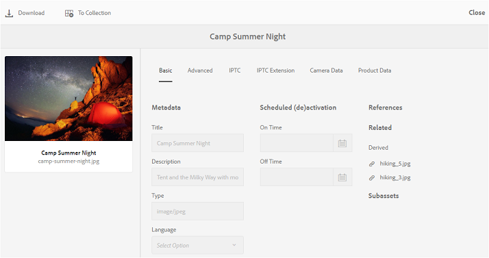

また、アセットの関係も AEM から Brand Portal に公開されているので、アセットのプロパティページですべての関連アセット（AEM 上のソースまたは派生アセット）のリストを表示することもできます。
