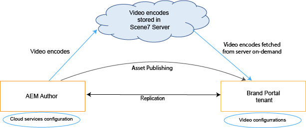
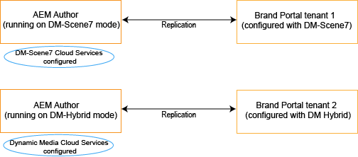
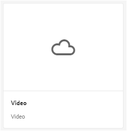
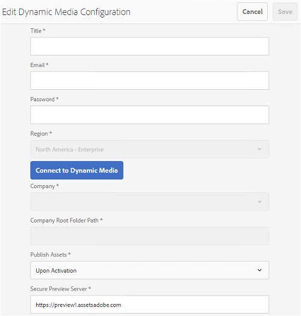

# Brand Portal でのダイナミックビデオのサポート {#dynamic-video-support-on-brand-portal}

Dynamic Media をサポートしている Brand Portal でビデオをアダプティブにプレビューおよび再生します。また、ポータルおよび共有リンクから動的レンディションをダウンロードします。Brand Portal を使用すると、次のことが可能になります。

* アセットの詳細ページ、カード表示、リンク共有のプレビューページでビデオをプレビューする。
* アセットの詳細ページでビデオエンコードを再生する。
* アセットの詳細ページの「レンディション」タブで動的レンディションを表示する。
* ビデオを格納したフォルダーとビデオエンコードをダウンロードする。

>[!NOTE]
>
>ビデオを操作したり Brand Portal に公開したりするには、AEM オーサーインスタンスが Dynamic Media ハイブリッドモードか Dynamic Media **[!DNL Scene 7]** モードのいずれかに設定されていることを確認してください。

ビデオをプレビュー、再生、ダウンロードするために、Brand Portal では次の 2 つの設定を管理者に公開しています。

* [Dynamic Media ハイブリッド設定](#configure-dm-hybrid-settings)：AEM オーサーインスタンスが Dynamic Media ハイブリッドモードで動作している場合。
* [Dynamic Media [!DNL Scene 7] 設定](#configure-dm-scene7-settings)：AEM オーサーインスタンスが Dynamic Media **[!DNL Scene 7]** モードで動作している場合。Brand Portal テナントの複製先となる AEM オーサーインスタンスに指定した設定に基づいて、これらの設定のいずれかを指定します。

>[!NOTE]
>
>**[!UICONTROL Scene7Connect]** 実行モードで動作している AEM オーサーとの連携が設定された Brand Portal テナントでは、ダイナミックビデオはサポートされていません。

## ダイナミックビデオの再生方法{#how-are-dynamic-videos-played}

Dynamic Media 設定（[ハイブリッド](../using/dynamic-video-brand-portal.md#configure-dm-hybrid-settings)設定または [[!DNL Scene 7]](../using/dynamic-video-brand-portal.md#configure-dm-scene7-settings) 設定）が Brand Portal で指定されている場合、動的レンディションは **[!DNL Scene 7]** サーバーから取得されます。したがって、ビデオエンコードは遅延や品質の劣化なしにプレビューおよび再生されます。

ビデオエンコードは Brand Portal リポジトリに格納されず、**[!DNL Scene 7]** サーバーから取得されるので、AEM オーサーインスタンスと Brand Portal の Dynamic Media 設定が同じであることを確認してください。

>[!NOTE]
>
>Brand Portal では、ビデオビューアとビューアプリセットはサポートされません。ビデオは Brand Portal のデフォルトのビューアでプレビューおよび再生されます。

## 前提条件 {#prerequisites}

Brand Portal 上でダイナミックビデオを操作するには、必ず以下をおこなってください。

* **DM（Dynamic Media）モードで AEM オーサーを起動する**
AEM オーサーインスタンス（Brand Portal の連携先）を [Dynamic Media ハイブリッドモード](https://helpx.adobe.com/jp/experience-manager/6-5/assets/using/config-dynamic.html#EnablingDynamicMedia)か [Dynamic Media [!DNL Scene 7] モード](https://helpx.adobe.com/jp/experience-manager/6-5/assets/using/config-dms7.html#EnablingDynamicMediainScene7mode)のいずれかで起動します。
* **AEM オーサー上で Dynamic Media クラウドサービスを設定する**
AEM オーサーが動作している Dynamic Media モードに基づいて、[Dynamic Media クラウドサービス](https://helpx.adobe.com/jp/experience-manager/6-5/assets/using/config-dynamic.html#ConfiguringDynamicMediaCloudServices)か [[!DNL Scene 7] クラウドサービス](https://helpx.adobe.com/jp/experience-manager/6-5/assets/using/config-dms7.html#ConfiguringDynamicMediaCloudServices)のいずれかを AEM オーサー上で設定します。それには、**ツール**／**クラウドサービス**／**Dynamic Media** を使用します。
* **Brand Portal 上で Dynamic Media を設定する**：Brand Portal 管理ツールで、AEM オーサー上の Dynamic Media クラウド設定に基づいて [Dynamic Media 設定](#configure-dm-hybrid-settings)か [[!DNL Scene 7] 設定](#configure-dm-scene7-settings)のいずれかを設定します。Dynamic Media ハイブリッドと Dynamic Media **[!UICONTROL S7]** の機能を使用する場合は、Dynamic Media ハイブリッドモードと Dynamic Media **[!UICONTROL Scene7]** モードで設定する AEM オーサーインスタンスに別個の [Brand Portal テナント](#separate-tenants)を使用する必要があります。
* **Brand Portal に適用したビデオエンコードを含んだフォルダーを公開する**
[ビデオエンコーディング](https://helpx.adobe.com/jp/experience-manager/6-5/assets/using/video-profiles.html)を適用し、リッチメディアアセットを含んだフォルダーを AEM オーサーインスタンスから Brand Portal に公開します。
* **セキュアプレビューが有効な場合SPS内の許可リスト出力IP** Dynamic Media-**[!DNL Scene 7]** (セキュアプレビューが会社に対して有効な場合 [)を使用する場合は、](https://docs.adobe.com/content/help/en/dynamic-media-classic/using/upload-publish/testing-assets-making-them-public.html) 会社管理者 **[!DNL Scene 7]** 許可リストIPsを使用する各SPS(scene7Scene Ui ui Flash)に対する公開出力IPs **** 。
エグレス IP は次のとおりです。

| **地域** | **エグレス IP** |
|--- |--- |
| 該当なし | 192.243.237.86 |
| EMEA | 185.34.189.4 |
| APAC | 63.140.44.54 |

To allowlist either of these egress IPs, see [prepare your account for secure testing service](https://docs.adobe.com/content/help/en/dynamic-media-classic/using/upload-publish/testing-assets-making-them-public.html#testing-the-secure-testing-service).

## ベストプラクティス

ダイナミックビデオアセットが Brand Portal（および共有リンク）から正常にプレビュー、再生、ダウンロードされるようにするには、次のベストプラクティスに従います。

### Dynamic Media ハイブリッドモードと Dynamic Media Scene7 モードでテナントが異なる {#separate-tenants}

Dynamic Media **[!DNL Scene 7]** 機能と Dynamic Media ハイブリッド機能の両方を使用している場合は、Dynamic Media ハイブリッドモードと Dynamic Media **[!DNL Scene 7]** モードで設定された AEM オーサーインスタンスに異なる Brand Portal テナントを使用することをお勧めします。 

### AEM オーサーインスタンスと Brand Portal で設定の詳細が同じ

**[!UICONTROL タイトル]**、**[!UICONTROL 登録 ID]**、**[!UICONTROL ビデオサービス URL]**（**[!UICONTROL Dynamic Media ハイブリッド]**&#x200B;の場合）や、**[!UICONTROL タイトル]**、資格情報（**[!UICONTROL 電子メール]**&#x200B;とパスワード）、**[!UICONTROL 地域]**、**[!UICONTROL 会社]**（Dynamic Media **[!DNL Scene 7]** の場合）などの設定詳細を、Brand Portal と **[!UICONTROL AEM クラウド設定]**&#x200B;で同じにする必要があります。

### Dynamic Mediaの許可リスト公開出力IP Scene7モード

Dynamic Media **[!UICONTROL Scene7]**（[セキュアプレビューが有効](https://docs.adobe.com/content/help/en/dynamic-media-classic/using/upload-publish/testing-assets-making-them-public.html)）を使用して Brand Portal にビデオアセットを配信する場合、**[!UICONTROL Scene7]** はステージング環境または内部アプリケーション用に専用の画像サーバーを設定します。このサーバーへのリクエストはすべて、発信元 IP アドレスをチェックします。受信リクエストが IP アドレスの承認済みリストに含まれていない場合は、失敗のレスポンスが返されます。そのため、**[!UICONTROL Scene7]** の会社管理者は、**[!UICONTROL SPS]**（Scene7 Publishing System）Flash UI を使用して、自社の&#x200B;**[!UICONTROL セキュアテスト]**&#x200B;環境用の承認済み IP アドレスリストを設定します。該当するそれぞれの地域のエグレス IP（以下を参照）を、その承認済みリストに必ず追加してください。To allowlist either of these egress IPs, see [prepare your account for secure testing service](https://docs.adobe.com/content/help/en/dynamic-media-classic/using/upload-publish/testing-assets-making-them-public.html#testing-the-secure-testing-service).
エグレス IP は次のとおりです。

| **地域** | **エグレス IP** |
|--- |--- |
| 該当なし | 192.243.237.86 |
| EMEA | 185.34.189.4 |
| APAC | 63.140.44.54 |

## Dynamic Media ハイブリッドの設定 {#configure-dm-hybrid-settings}

AEM オーサーインスタンスが Dynamic Media ハイブリッドモードで動作している場合は、管理ツールパネルの&#x200B;**[!UICONTROL ビデオ]**&#x200B;タイルを使用して、Dynamic Media ゲートウェイを設定します。
>[!NOTE]
>
>[ビデオエンコーディングプロファイル](https://helpx.adobe.com/jp/experience-manager/6-5/assets/using/video-profiles.html)は Brand Portal には公開されず、代わりに **[!UICONTROL Scene7]** サーバーから取得されます。そのため、ビデオエンコードが Brand Portal で正常に再生されるには、設定の詳細を AEM オーサーインスタンスの [[!UICONTROL Scene7 クラウド設定]](https://helpx.adobe.com/jp/experience-manager/6-5/assets/using/config-dms7.html#ConfiguringDynamicMediaCloudServices)と同じにする必要があります。Brand Portal テナントで Dynamic Media 設定をセットアップするには：

1. Brand Portal で上部のツールバーにある AEM ロゴをクリックして、管理ツールにアクセスします。

2. 管理ツールパネルで&#x200B;**[!UICONTROL ビデオ]**&#x200B;タイルを選択します。 

   
   **[!UICONTROL Dynamic Media 設定を編集]**&#x200B;ページが開きます。 
   

3. 「**[!UICONTROL 登録 ID]**」と「**[!UICONTROL ビデオサービスの URL]**」（DM ゲートウェイの URL）を指定します。これらの詳細が、AEM オーサーインスタンスの&#x200B;**[!UICONTROL ツール／クラウドサービス]**&#x200B;で指定した内容と同じであることを確認してください。

4. 「**保存**」をクリックして、設定を保存します。

## Dynamic Media Scene7 の設定 {#configure-dm-scene7-settings}

AEM オーサーインスタンスが Dynamic Media - **[!UICONTROL Scene7]** モードで動作している場合は、管理ツールパネルの **[!UICONTROL Dynamic Media 設定]**&#x200B;タイルを使用して、**[!UICONTROL Scene7]** サーバーを設定します。

Brand Portal テナントで Dynamic Media **[!UICONTROL Scene7]** 設定をセットアップするには：

1. Brand Portal で上部のツールバーにある AEM ロゴをクリックして、管理ツールにアクセスします。

2. 管理ツールパネルで **[!UICONTROL Dynamic Media 設定]**&#x200B;タイルを選択します。 
   ![Brand Portal での DM [!UICONTROL Scene7] の設定](assets/DMS7-Tile.png)
   **[!UICONTROL Dynamic Media 設定を編集]**&#x200B;ページが開きます。 
   

3. 以下を指定します。
   * **[!UICONTROL タイトル]**
   * Scene7 サーバーにアクセスするための認証情報（**[!UICONTROL 電子メール ID]** と&#x200B;**[!UICONTROL パスワード]**）
   * **[!UICONTROL 地域]**：これらの値が、AEM オーサーインスタンスで指定した内容と同じであることを確認してください。

4. 「**[!UICONTROL Dynamic Media に接続]**」をクリックします。

5. **[!UICONTROL 会社名]**&#x200B;を指定し、設定を&#x200B;**[!UICONTROL 保存]**&#x200B;します。
