# Brand Portal へのゲストによるアクセス {#guest-access-to-brand-portal}

AEM Brand Portal は、ゲストによるポータルへのアクセスを許可します。ゲストユーザーは資格情報がなくてもポータルに入ることができ、ポータルの公開アセット（およびコレクション）へのアクセス権を持ちます。ゲストセッション中のユーザーは Lightbox（非公開コレクション）にアセットを追加でき、セッションが続いている間（[[!UICONTROL セッションの終了]](#exit-guest-session)を選択した場合を除いてセッションの開始から 2 時間）は同様にダウンロードすることができます。

ゲストによるアクセス機能を使用すれば、組織は対象オーディエンスのオンボーディングをおこなわなくても、[承認済みアセットをすばやく共有](../using/brand-portal-sharing-folders.md#how-to-share-folders)することができます。Brand Portal 6.4.2 以降には、複数の同時ゲストユーザー（組織あたりの合計ユーザークォータの 10%）に対応する機能が搭載されています。ゲストによるアクセスを許可することで、Brand Portal の限られた機能を使う必要があるユーザーのスコアの管理やオンボーディングにかかる時間を節約できます。\
管理ツールパネルの「**[!UICONTROL アクセス]**」設定の「**[!UICONTROL &#x200B;ゲストによるアクセスを許可]**」オプションを使用して、組織の Brand Portal アカウントでのゲストによるアクセスを有効化（または無効化）できます。

<!--
Comment Type: annotation
Last Modified By: mgulati
Last Modified Date: 2018-08-17T10:42:59.879-0400
Removed the first para: "AEM Assets Brand Portal allows public users to enter the portal anonymously and have restricted access to the allowed public resources as guests. Organization users with guest role need not seek access and authentication from administrators."
-->

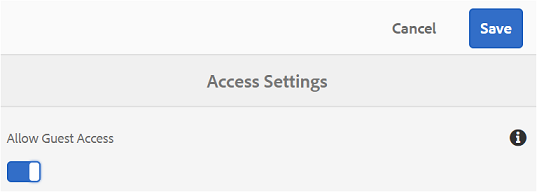

## ゲストセッションの開始 {#begin-guest-session}

匿名で Brand Portal に入るには、Brand Portal のようこそ画面で&#x200B;**[!UICONTROL ゲストとしてアクセスしますか？]**の横にある「**[!UICONTROL &#x200B;ここをクリックしてください]**」を選択します。ユーザーは、アクセス権を要求したり、管理者から認証を受けてアクセス権が付与されるのを待たなくても、Brand Portal を使用することができます。

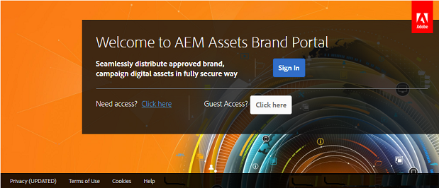

## ゲストセッションの期間 {#guest-session-duration}

ゲストユーザーセッションは 2 時間アクティブのままになります。つまり、**[!UICONTROL Lightbox]**の状態はセッションの開始時刻から 1 時間保持され、2 時間後に現在のゲストセッションが再起動して Lightbox の状態が失われます。\
例えば、ゲストユーザーが 15:00 に Brand Portal にログインし、16:50 にダウンロード用の Lightbox にアセットを追加するとします。ユーザーが 17:00 より前に **[!UICONTROL Lightbox]**コレクション（またはそのアセット）をダウンロードしなかった場合、**[!UICONTROL  Lightbox]** は空になります。これは、ユーザーが 1 時間の最後（17:00）にセッションを再起動しなければならないからです。

## 許可されている同時ゲストセッション {#concurrent-guest-sessions-allowed}

同時ゲストセッションの数は、組織あたりの合計ユーザークォータの 10% に制限されます。つまり、ユーザークォータが 200 の組織の場合、最大 20 人のゲストユーザーが同時に作業をすることができます。21 番目のユーザーはアクセスを拒否され、20 人のアクティブなゲストユーザーのいずれかがセッションを終了した場合にのみゲストとしてアクセスできるようになります。

## ゲストユーザーの Brand Portal の操作 {#guest-user-interaction-with-brand-portal}

### ゲスト UI ナビゲーション

ゲストとして Brand Portal に入ると、すべてのユーザーまたはゲストユーザーのみと[共有されているアセットおよびフォルダー](../using/brand-portal-sharing-folders.md#sharefolders)をすべて表示できます。これはコンテンツのみの表示であり、アセットがカード、リストまたは列レイアウトで表示されます。

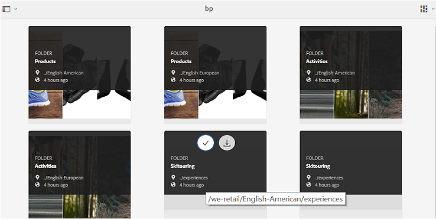

ただし、管理者が「[フォルダー階層を有効化](../using/brand-portal-general-configuration.md#main-pars-header-1621071021)」設定を有効にしていた場合は、ゲストユーザーが Brand Portal にログインしたときに、ルートフォルダーから始まるフォルダーツリーと、それぞれの親フォルダー内に含まれる共有フォルダーが表示されます。

これらの親フォルダーは仮想フォルダーであり、これらに対してアクションを実行することはできません。仮想フォルダーは鍵のアイコン付きで表示されます。

**[!UICONTROL カード表示]**でこれらをカーソルで指したり選択したりしても、共有フォルダーとは異なり、アクションタスクは表示されません。**[!UICONTROL &#x200B;列表示]**や&#x200B;**[!UICONTROL リスト表示]**で仮想フォルダーを選択すると「**[!UICONTROL &#x200B;概要]**」ボタンが表示されます。

>[!NOTE]
>
>仮想フォルダーのデフォルトのサムネールは最初の共有フォルダーのサムネール画像になることに注意してください。

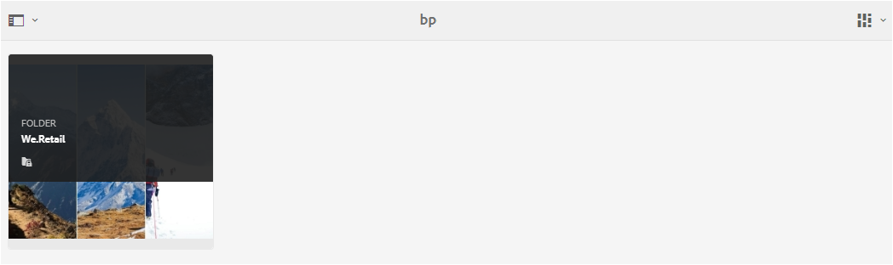 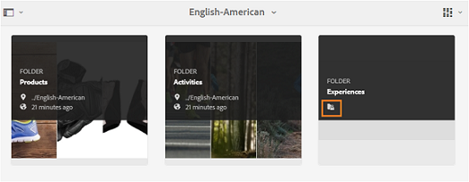 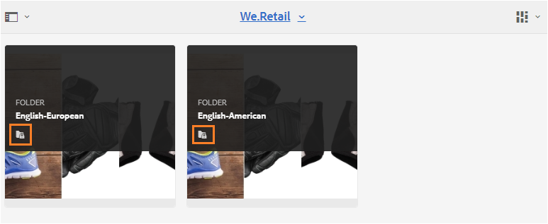 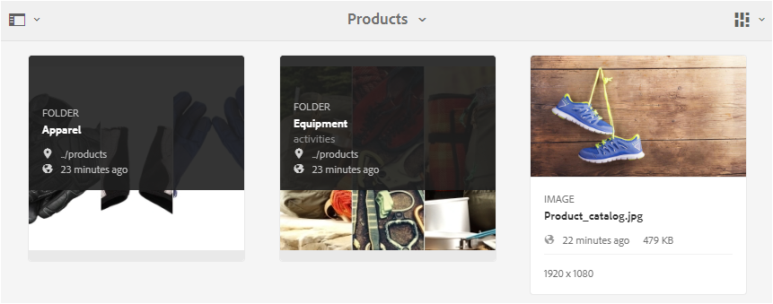

「**[!UICONTROL 表示設定]**」オプションでは、ゲストユーザーは、**[!UICONTROL &#x200B;カード表示]**のカードサイズや、**[!UICONTROL リスト表示]**に表示する列を調整することができます。

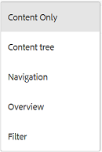

**[!UICONTROL コンテンツツリー]**では、アセット階層内を移動することができます。

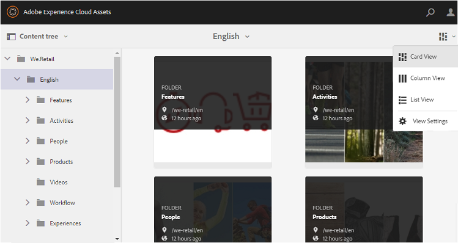

Brand Portal には、選択したアセット／フォルダーの&#x200B;**[!UICONTROL アセットプロパティ]**をゲストユーザーが表示できる「**[!UICONTROL &#x200B;概要]**」オプションがあります。「**[!UICONTROL 概要]**」オプションは、次の場所に表示されます。

* アセットやフォルダーを選択する際に上部に表示されるツールバー。
* レールセレクターを選択する際のドロップダウン。アセットやフォルダーを選択した状態で「**[!UICONTROL 概要]**」オプションを選択すると、タイトル、パス、アセット作成時間を確認できます。一方、アセットの詳細ページで「**[!UICONTROL &#x200B;概要]**」オプションを選択すると、アセットのメタデータを確認できます。

 

左レールの「**[!UICONTROL ナビゲーション]**」オプションでは、ファイルからコレクションに移動したり、ユーザーがファイルやコレクションのアセットから参照できるよう、ゲストセッションに戻ったりすることができます。

「**[!UICONTROL フィルター]**」オプションを使用すると、ゲストユーザーは管理者が設定した検索用述語を使用して、アセットファイルやフォルダーにフィルターを適用することができます。

### ゲストユーザーの機能

ゲストユーザーは Brand Portal の公開アセットにアクセスできますが、制約もいくつかあります（これについては後で説明します）。

**ゲストユーザーは**、

* すべてのBrand portalユーザー用のすべてのパブリックフォルダーとコレクションにアクセスします。
* メンバーを参照し、詳細ページを開き、すべてのパブリックフォルダーとコレクションのメンバーの完全なアセットビューを持ちます。
* パブリックフォルダーとコレクション全体でアセットを検索します。
* ライトボックスコレクションにアセットを追加します。 コレクションに対するこれらの変更は、セッションの間保持されます。
* アセットを直接ダウンロードするか、ライトボックスコレクションを使用してダウンロードします。

**ゲストユーザーは**、

* コレクションを作成して保存済みの検索結果を作成したり、さらに共有したりできます。
* フォルダーとコレクションの設定にアクセスします。
* アセットをリンクとして共有します。

### ゲストセッションでアセットをダウンロードする

ゲストユーザーは、公開アセット、またはゲストユーザーのみと共有されたアセットを Brand Portal で直接ダウンロードできます。また、ゲストユーザーは **[!UICONTROL Lightbox]**（公開コレクション）にアセットを追加したり、セッションが期限切れになる前に**[!UICONTROL  Lightbox]** コレクションをダウンロードしたりできます。

アセットやコレクションをダウンロードするには、次の場所のダウンロードアイコンを使用します。

* クイックアクションサムネール。アセットまたはコレクションの上にカーソルを置くと表示されます。
* 上部のツールバー。アセットまたはコレクションの選択時に表示されます。

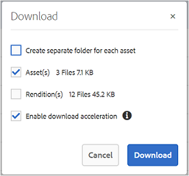

**[!UICONTROL ダウンロード]**ダイアログで「[!UICONTROL ダウンロードアクセラレーションを有効化]」を選択すると、[ダウンロードパフォーマンスを強化](../using/accelerated-download.md)することができます。

## ゲストセッションの終了 {#exit-guest-session}

ゲストセッションを終了するには、ヘッダーにあるオプションから「**[!UICONTROL セッションを終了]**」を使用します。ただし、ゲストセッションに使用されるブラウザータブが非アクティブになっている場合、アクティビティがおこなわれなくなってから 2 時間が経過するとセッションは自動的に期限切れとなります。

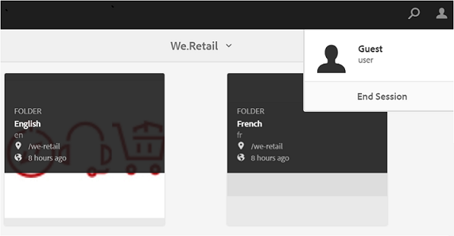

## ゲストユーザーアクティビティの監視 {#monitoring-guest-user-activities}

管理者は、Brand Portal でのゲストユーザーの操作を監視できます。Brand Portal で生成されたレポートは、ゲストユーザーアクティビティに関する重要なインサイトを提供できます。例えばたとえば、**[!UICONTROL ダウンロード]**レポートを使用すると、ゲストユーザーによってダウンロードされたアセットの数を追跡できます。**[!UICONTROL &#x200B;ユーザーログイン]**レポートでは、ゲストユーザーがポータルに最後にログインした時刻、および指定期間内のログイン頻度を確認ができます。
