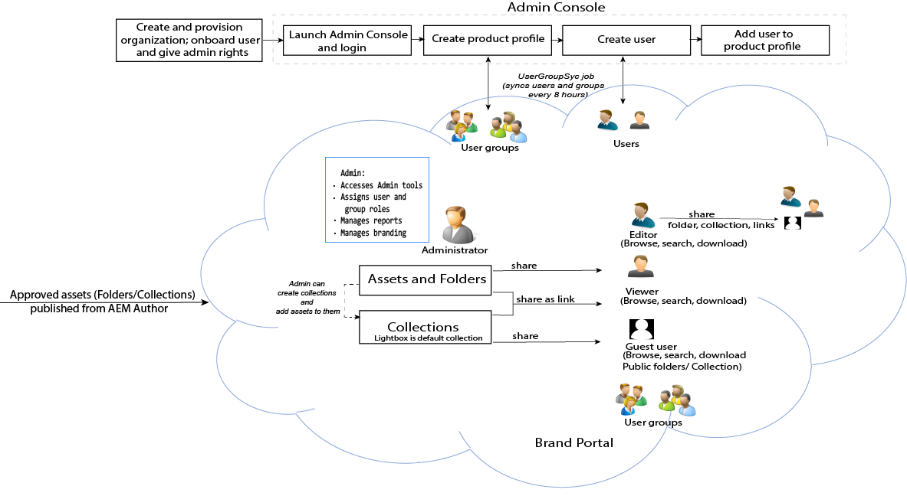

# Adobe Experience Manager Assets Brand Portal ガイド {#aem-brand-portal}

**Adobe Experience Manager Assets Brand Portal** は、組織が承認済みのブランドおよび製品アセットを外部の代理店、パートナー、内部チーム、販売店などにダウンロードで安全に配布してマーケティングニーズに応えるうえで役に立ちます。

安全なアセット共有ソリューションがないと、次のことが考えられます。

* メールまたはクラウドを通じた手動アセット共有
* ブランドコンプライアンスの問題
* アセットの使用に対する制御の不足
* キャンペーンと製品の起動の遅延
* 地理的な場所や組織間でのコンテンツの重複
* リリース前のアセットの保護されていないストレージ

Brand Portal を利用することで、マーケターがチャネルパートナーや社内ビジネスユーザーと協力して最新のデザインガイドライン、ロゴ、キャンペーン、製品アセットを迅速に作成、管理、関係者に配信できるようになるので、組織はブランドコンプライアンスを保証できます。Brand Portal は、クラウドベースの SaaS 製品です。Adobe Experience Manager Assets 製品（オンプレミスまたはマネージドサービス）へのアドオンとして利用できます。Brand Portalは、 [!DNL Adobe Experience Manager Assets] as a [!DNL Cloud Service]. 1 回 [設定済み](https://experienceleague.adobe.com/docs/experience-manager-cloud-service/content/assets/brand-portal/configure-aem-assets-with-brand-portal.html?lang=ja)を使用すると、 [!DNL Adobe Experience Manager Assets] as a [!DNL Cloud Service] インスタンスから [!DNL Brand Portal] Brand Portalユーザーに配布します。

Brand Portal ソリューションワークフローを次の画像に示します。

## Adobe Experience Manager Brand Portal ユーザーガイド

このユーザーガイドでは Brand Portal のサービスおよび主要ワークフローについて説明しています。左側のレールを使用すると、各種機能をナビゲートでき、様々なペルソナがポータルとどのようにやり取りするかを理解することができます。

### 関連トピック

| ユーザーガイド | 説明 |
|--- |---|
| [新機能](whats-new.md) | Brand Portal の以前のリリースからの変更内容および最新の機能。 |
| [リリースノート](brand-portal-release-notes.md) | 現在のリリースにおける機能強化、解決された重要な問題、既知の問題。 |
| [Experience Manager Assets と Brand Portal の連携の設定](../using/configure-aem-assets-with-brand-portal.md) | アセットを公開するための Brand Portal と Experience Manager Assets のレプリケート方法。 |
| [並列公開における問題のトラブルシューティング](troubleshoot-parallel-publishing.md) | Brand Portal と Experience Manager Assets 間のレプリケーションのトラブルシューティング。 |
| [サポートされているファイル形式](brand-portal-supported-formats.md) | Brand Portal でプレビューおよびダウンロード用にサポートされるファイル形式。 |
| [Brand Portal へのアセットの公開](brand-portal-sharing-folders.md) | フォルダー、コレクション、リンク、プリセット、スキーマ、ファセット、タグを Brand Portal に公開する方法。 |
| [Brand Portal でのアセットソーシング](brand-portal-asset-sourcing.md) | AEM Assets でアセットソーシングを設定し、Brand Portal でアセットをアップロードして、コントリビューションフォルダーを AEM Assets に公開し直す方法。 |
| [Brand Portal の注目のビデオ](https://experienceleague.adobe.com/?lang=ja&amp;tag=Brand+Portal#recommended/solutions/experience-manager) | ビデオチュートリアルを利用して、Experience Manager Assets Brand Portal の使用方法を学びます。 |

### 役立つリソース

* [AEM Assets と Brand Portal について](https://experienceleague.adobe.com/docs/experience-manager-brand-portal/using/home.html?lang=ja)
