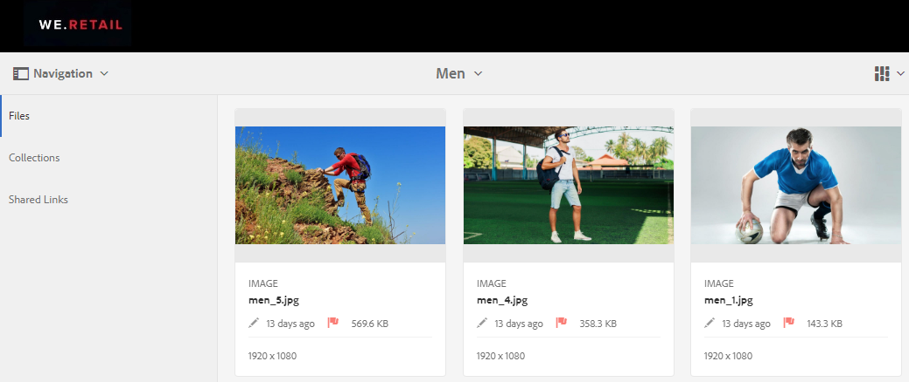
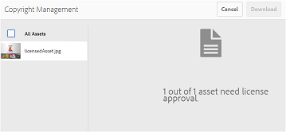
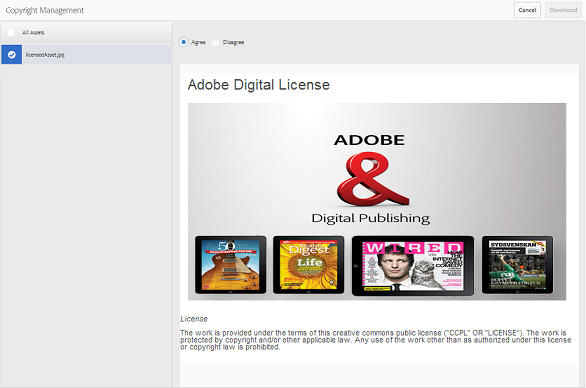
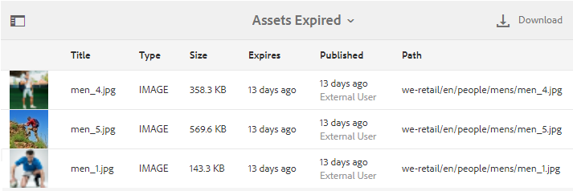

# アセットのデジタル著作権の管理 {#manage-digital-rights-of-assets}

ブランドを守るには、クリエイティブアセットやブランドマテリアルの配布および使用を適切に保護することが不可欠です。これを組織の内外にわたって確実に適用するには、AEM から Brand Portal に公開される承認済みアセットに有効期限の日時を設定したり、アセットの条件付き使用を認めるライセンスを供与したりします。また、Brand Portal から共有されるアセットへのリンクに有効期限日を指定することもできます。

以下では、Brand Portal 上のアセットを安全に保護する方法と、関連する使用権限について説明します。

## アセットの有効期限 {#asset-expiration}

アセットの有効期限は、Brand Portal 上の承認済みアセットの使用を組織全体にわたって制御する有効な方法です。AEM Assets から Brand Portal に公開されるアセットには必ず有効期限日が設定されており、この設定によって、様々なユーザーの役割によるアセットの使用が制限されています。

### 期限切れアセットに関連する使用権限 {#usage-permissions-expired-assets}

Brand Portal では、管理者は期限切れアセットを表示したり、ダウンロードしたり、コレクションに追加したりできます。一方、編集者と閲覧者にできるのは、期限切れアセットの表示とコレクションへの追加だけです。

管理者は期限切れアセットを AEM Assets から Brand Portal に公開できます。しかし、期限切れアセットを Brand Portal からリンクを介して共有することはできません。期限切れアセットと期限切れでないアセットの両方を含むフォルダーから期限切れアセットを選択している場合は、「**[!UICONTROL リンクを共有]**」アクションは使用できません。しかし、期限切れアセットと期限切れでないアセットを含んだフォルダーそのものを選択している場合は、「[!UICONTROL 共有]」アクションと「**[!UICONTROL リンクを共有]**」アクションを使用できます。

>[!NOTE]
>
>フォルダーは、その中に期限切れアセットが含まれている場合でも、リンクとして共有できます。その場合、共有されたリンクは期限切れアセットをリストせず、期限切れでないアセットのみが共有されます。

以下の表に、期限切れアセットの使用権限を示します。

|  | **[!UICONTROL リンク共有]** | **[!UICONTROL ダウンロード]** | **[!UICONTROL プロパティ]** | **[!UICONTROL コレクションに追加]** | **[!UICONTROL 削除]** |
|---|---|---|---|---|---|
| **[!UICONTROL 管理者]** | 使用不可 | 使用可 | 使用可 | 使用可 | 使用可 |
| **[!UICONTROL 編集者]** | 使用不可 | 使用不可 | 使用可 | 使用可 | 使用不可 |
| **[!UICONTROL 閲覧者]** | 使用不可 | 使用不可 | 使用可 | 使用可 | 使用不可 |
| **[!UICONTROL ゲストユーザー]** | 使用不可 | 使用不可 | 使用可 | 使用可 | 使用不可 |

>[!NOTE]
>
>閲覧者およびエディターが期限切れアセットと期限切れでないアセットを含むフォルダーをダウンロードした場合は、期限切れでないアセットのみがダウンロードされます。フォルダーに期限切れアセットのみが含まれている場合は、空のフォルダーがダウンロードされます。

### アセットの有効期限ステータス {#expiration-status-of-assets}

アセットの有効期限ステータスは&#x200B;**[!UICONTROL カード表示]**&#x200B;で確認できます。カード上の赤いフラグは、そのアセットが期限切れであることを示しています。

>[!NOTE]
>
>リスト表示と列表示では、アセットの有効期限ステータスは表示されません。

## アセットのリンクの有効期限 {#asset-link-expiration}

管理者およびエディターは、リンクを通じてアセットを共有する一方で、**[!UICONTROL リンク共有]**&#x200B;ダイアログボックスの「**[!UICONTROL 有効期限]**」フィールドを使用して有効期限の日時を設定できます。リンクのデフォルトの有効期限は、リンクが共有された日から 7 日間です。

これにより、リンクとして共有されたアセットは Brand Portal の管理者およびエディターが設定した日時に期限切れになり、その後は表示もダウンロードもできなくなります。リンクを通じて共有されたアセットは、組織の一員でない外部ユーザーからも見られるので、有効期限を指定することで、承認済みアセットを保護し、指定の日時以降は未知の人物に見られないようにすることができます。

リンク共有について詳しくは、[アセットをリンクとして共有](../using/brand-portal-link-share.md)を参照してください。

## ライセンスで保護されたアセット {#licensed-assets}

ライセンスで保護されたアセットを Brand Portal からダウンロードするときは、事前に使用許諾契約への同意が求められます。ライセンスで保護されたアセットの使用許諾契約は、アセットを Brand Portal から直接ダウンロードまたは共有リンクを介してダウンロードするときに表示されます。ライセンスで保護されたアセットは、期限切れの場合も期限切れでない場合も、すべてのユーザーが見ることができます。しかし、ライセンスで保護された期限切れアセットのダウンロードと使用には制限が適用されます。ライセンスで保護された期限切れアセットの動作と、ユーザーの役割に基づいて許可される活動については、[期限切れアセットの使用権限](../using/manage-digital-rights-of-assets.md#usage-permissions-expired-assets)を参照してください。

ライセンスで保護されているアセットには、[使用許諾契約が添付](https://helpx.adobe.com/jp/experience-manager/6-5/assets/using/drm.html#DigitalRightsManagementinAssets)されています。この処理は、AEM Assets でアセットの[メタデータプロパティ](https://helpx.adobe.com/jp/experience-manager/6-5/assets/using/drm.html#DigitalRightsManagementinAssets)を設定することでおこなわれます。

ライセンスで保護されたアセットをダウンロードする場合は、**[!UICONTROL 著作権管理]**&#x200B;ページにリダイレクトされます。

ここでダウンロードするアセットを選択し、関連付けられた使用許諾契約に同意する必要があります。使用許諾契約に同意しない場合、「**[!UICONTROL ダウンロード]**」ボタンは無効になります。

選択した項目に保護されたアセットが複数含まれている場合は、アセットを 1 つずつ選択して使用許諾契約に同意し、アセットのダウンロードに進みます。

## 期限切れアセットに関するレポートの生成 {#generate-report-about-expired-assets}

管理者は、特定の期間内に期限切れになったすべてのアセットをリストするレポートを生成してダウンロードできます。このレポートには、期限切れアセットについての詳細情報（サイズ、種類、アセット階層内のアセットの場所を示すパス、アセットが期限切れになった日時、アセットが公開された日時など）が含まれます。このレポートの列はカスタマイズ可能であり、表示するデータを要件に応じて増やすことができます。

レポートの機能について詳しくは、[レポートの操作](../using/brand-portal-reports.md#work-with-reports)を参照してください。
