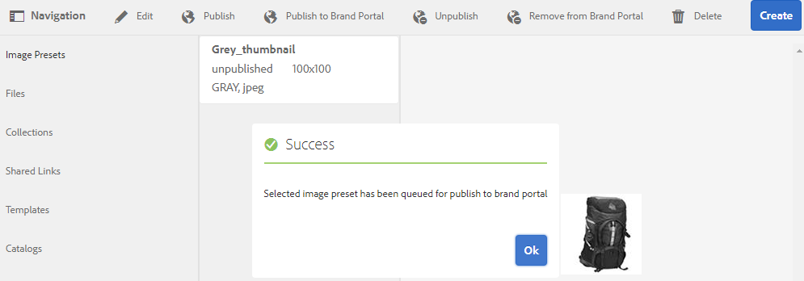
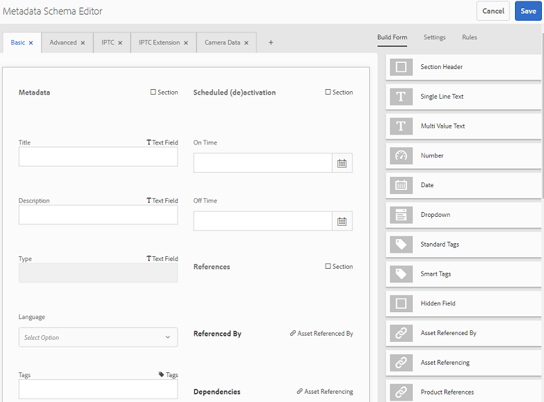
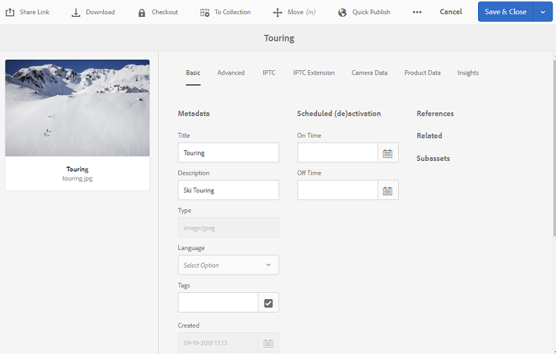
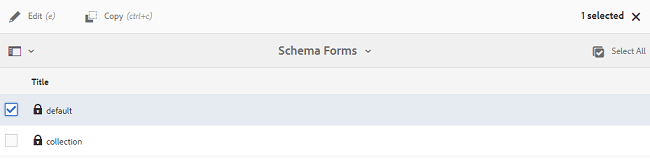
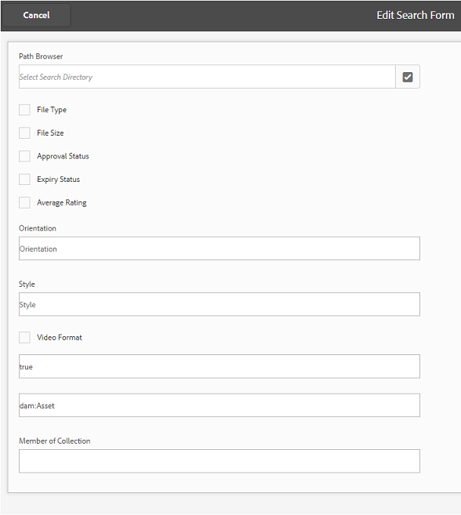
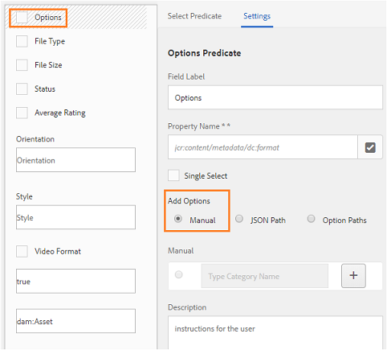

# Brand Portal へのプリセット、スキーマ、ファセットの公開 {#publish-presets-schema-and-facets-to-brand-portal}

The article delves into publishing image presets, metadata schemas, and custom search facets from [!DNL AEM] Author instance to [!DNL Brand Portal]. Publishing capability enables organizations to reuse the image presets, metadata schemas, and search facets created/modified at [!DNL AEM] Author instance thereby reducing duplicate efforts.

>[!NOTE]
>
>The capability to publish image presets, metadata schema, and search facets from [!DNL AEM] Author instance to [!DNL Brand Portal] is available [!DNL AEM 6.2 SP1-CFP7] and [!DNL AEM 6.3 SP 1-CFP 1 (6.3.1.1)] onwards.

## Brand Portal への画像プリセットの公開 {#publish-image-presets-to-brand-portal}

画像プリセットとは、画像配信の際に画像に適用される一連のサイズ変更コマンドやフォーマットコマンドをまとめたものです。Image presets can be created and modified at [!DNL Brand Portal]. Alternatively, if [!DNL AEM] Author instance is running in dynamic media mode then users can create presets at the [!DNL AEM] Author and publish them to [!DNL AEM Assets Brand Portal], and avoid re-creating the same presets at [!DNL Brand Portal].\
プリセットを作成すると、それがアセット詳細のレンディションレールとダウンロードダイアログに動的レンディションとしてリストされます。

>[!NOTE]
>
>[!DNL AEM] 作成者インスタンスがモード（ [!DNL Dynamic Media] 顧客が購入していない） [!DNL Dynamic Media]で実行されていない場合、アップロード時にアセットの [!UICONTROL ピラミッドTIFF] レンディションが作成されません。画像プリセットまたは動的レンディションは、アセットの [!UICONTROL ピラミッドTIFF] で機能するので、 [!UICONTROL ピラミッドTIFF] が作成者インスタンスで [!DNL AEM] 使用できない場合は、そのTIFFを使用 [!DNL Brand Portal] できません。その結果、アセット詳細ページのレンディションレールに動的レンディションが表示されず、ダイアログがダウンロードされます。

To publish image presets to [!DNL Brand Portal]:

1. [!DNL AEM] 作成者インスタンスで、ロゴを [!DNL AEM] タップまたはクリックしてグローバルナビゲーションコンソールにアクセスし、ツールアイコンをタップまたはクリックして、 **[!UICONTROL アセット]** / **[!UICONTROL 画像プリセットに移動]**&#x200B;します。
2. Select the image preset or multiple image presets from the list of image presets and click/ tap **[!UICONTROL Publish to Brand Portal]**.

>[!NOTE]
>
>When users click **[!UICONTROL Publish to Brand Portal]** the image presets are queued for publishing. レプリケーションエージェントのログを監視して、公開が成功したかどうかを確認することを推奨します。

画像プリセットの公開元から公開を取り消す [!DNL Brand Portal]には:

1. [!DNL AEM] 作成者インスタンスで、ロゴを [!DNL AEM] タップまたはクリックしてグローバルナビゲーションコンソールにアクセスし、ツールアイコンをタップまたはクリックして、 **[!UICONTROL アセット]** / **[!UICONTROL 画像プリセットに移動]**&#x200B;します。
2. 画像プリセットを選択し、上部にあるオプションから「**[!UICONTROL Brand Portal から削除]」を選択します。**

## Brand Portal へのメタデータスキーマの公開  {#publish-metadata-schema-to-brand-portal}

メタデータスキーマは、アセットまたはコレクションのプロパティページに表示されるレイアウトとプロパティを記述します。

 

If users have edited the default schema on [!DNL AEM] Author instance and are willing to use the same schema as default schema on the [!DNL Brand Portal], they can simply publish the metadata schema forms to [!DNL Brand Portal]. In such a scenario, the default schema at [!DNL Brand Portal] is over-ridden by the default schemas published from [!DNL AEM] Author instance.

If users have created a custom schema on [!DNL AEM] Author instance, they can publish the custom schema to [!DNL Brand Portal] instead of re-creating the same custom schema there. Users can then apply this custom schema to any folder/ collection in [!DNL Brand Portal].

>[!NOTE]
>
>Default schemas cannot be published to the [!DNL Brand Portal] if they are locked at the [!DNL AEM] instance (that is they are unedited).

>[!NOTE]
>
>If a folder has a schema applied on [!DNL AEM] Author instance, the same schema must also exist on the [!DNL Brand Portal] to maintain the consistency in the asset properties page on [!DNL AEM] Author and [!DNL Brand portal].

To publish a metadata schema from [!DNL AEM] Author instance to [!DNL Brand Portal]:

1. [!DNL AEM] 作成者インスタンスで、AEMロゴをタップまたはクリックしてグローバルナビゲーションコンソールにアクセスし、ツールアイコンをタップまたはクリックして、 **[!UICONTROL アセット]** / **[!UICONTROL メタデータスキーマに移動]**&#x200B;します。
2. メタデータスキーマを選択し、上部にあるオプションから「**[!UICONTROL Brand Portal に公開]」を選択します。**

>[!NOTE]
>
>When users click **[!UICONTROL Publish to Brand Portal]**, the metadata schemas are queued for publishing. レプリケーションエージェントのログを監視して、公開が成功したかどうかを確認することを推奨します。

To unpublish a metadata schema from [!DNL Brand Portal]:

1. [!DNL AEM] 作成者インスタンスで、ロゴを [!DNL AEM] タップまたはクリックしてグローバルナビゲーションコンソールにアクセスし、ツールアイコンをタップまたはクリックして、 **[!UICONTROL アセット]** / **[!UICONTROL メタデータスキーマに移動]**&#x200B;します。
2. メタデータスキーマを選択し、上部にあるオプションから「**[!UICONTROL Brand Portal から削除]」を選択します。**

## Brand Portal への検索ファセットの公開 {#publish-search-facets-to-brand-portal}

Search forms provide the capability of [faceted search](../using/brand-portal-search-facets.md) to users on [!DNL Brand Portal]. Search facets impart greater granularity to searches on [!DNL Brand Portal]. All the [predicates added](https://helpx.adobe.com/experience-manager/6-5/assets/using/search-facets.html#AddingaPredicate) in the search form are available to users as search facets in search filters.

If you are willing to use custom search form **[!UICONTROL Assets Admin Search Rail]** from [!DNL AEM] Author instance, then instead of re-creating the same form on [!DNL Brand Portal] you can publish the customized search form from [!DNL AEM] Author instance to [!DNL Brand Portal].

>[!NOTE]
>
>Locked search form **[!UICONTROL Assets Admin Search Rail]** on AEM Assets cannot be published to [!DNL Brand Portal] unless it is edited. Once edited and published to [!DNL Brand Portal], this search form overrides the search form on [!DNL Brand Portal].

To publish the edited search facet from [!DNL AEM] Author instance to [!DNL Brand Portal]:

1. Tap/click the [!DNL AEM] logo, and then go to **[!UICONTROL Tools]** &gt; **[!UICONTROL General]** &gt; **[!UICONTROL Search Forms]**.
2. Select the edited search form, and select **[!UICONTROL Publish to Brand Portal]**.

   >[!NOTE]
   >
   >When users click **[!UICONTROL Publish to Brand Portal]**, the search facets are queued for publishing. レプリケーションエージェントのログを監視して、公開が成功したかどうかを確認することを推奨します。

To unpublish search forms from [!DNL Brand Portal]:

1. [!DNL AEM] 作成者インスタンスで、ロゴを [!DNL AEM] タップまたはクリックしてグローバルナビゲーションコンソールにアクセスし、ツールアイコンをタップまたはクリックして **[!UICONTROL 、一般]** / **[!UICONTROL 検索フォームに移動]**&#x200B;します。
2. 検索フォームを選択し、上部にあるオプションから「**[!UICONTROL Brand Portal から削除]」を選択します。**

>[!NOTE]
>
>**[!UICONTROL ブランドポータル]** のアクションからの非公開では、デフォルトの検索フォームがブランドポータルに残り、公開前に使用された最後の検索フォームに復元されません。

### 制限事項 {#limitations}

1. Few search predicates are not applicable to search filters on the [!DNL Brand Portal]. When these search predicates are published as part of the search form from [!DNL AEM] Author instance to [!DNL Brand Portal], they are filtered out. Users, therefore, see less number of predicates in the published form at the [!DNL Brand Portal]. 詳しくは、[Brand Portal 上のフィルターに適用可能な検索用述語の一覧](../using/brand-portal-search-facets.md#list-of-search-predicates)を参照してください。

2. [!UICONTROL Options] Predicateの場合、ユーザーがAEM作成者インスタンスで読み取りオプションを使用するためのカスタムパスを使用している場合、ブランドポータルでは動作しません。このような追加のパスやオプションは、検索フォームと一緒に Brand Portal へ公開されません。In this case, users can select the **[!UICONTROL Manual]** option in **[!UICONTROL Add Options]** within **[!UICONTROL Options Predicate]** to add these options manually at [!DNL Brand Portal].

