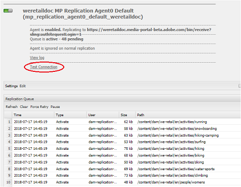

# Brand Portal への並列公開における問題のトラブルシューティング {#troubleshoot-issues-in-parallel-publishing-to-brand-portal}

ブランドポータルは、AEM Assetsと統合して、AEM Assets作成者インスタンスからシームレスにインジェスト（または公開）したブランドアセットを承認します。[統合](https://helpx.adobe.com/experience-manager/6-5/assets/using/brand-portal-configuring-integration.html)が完了すると、AEM Authorは、選択したアセットをブランドポータルのユーザーが承認するために、選択したアセットをブランドポータルクラウドサービスに複製します。複数の複製エージェントがAEM6.2SP1- CFP5]、AEM CFP6.3.0.2および以降を使用して、高速な並行公開を可能にします。

>[!NOTE]
>
>AEM Assets Brand Portal と AEM Assets を適切に連携させるには、AEM 6.4.1.0 にアップグレードすることを推奨します。AEM6.4の制限により、ブランドポータルとの統合の設定中にエラーが発生することがあります。

[!UICONTROL /etc/cloudservice]のブランドポータルのクラウドサービスを設定すると、必要なすべてのユーザーとトークンが自動生成され、リポジトリに保存されます。クラウドサービスの設定が作成され、複製に必要なサービスユーザーと、コンテンツを複製するために必要なサービスユーザーも作成されます。これによって 4 つのレプリケーションエージェントが作成されます。したがって、AEMからブランドポータルに多数のアセットを公開すると、これらのアセットはラウンドロビンを介して、これらの複製エージェント間でキューに格納され分散されます。

However, publishing can fail intermittently due to- large sling jobs, increased Network and [!UICONTROL Disk I/O] on AEM Author instance, or slowed performance of AEM Author instance. したがって、公開を開始する前に複製エージェントとの接続をテストすることをお勧めします。

## Troubleshoot failures in first time publishing: validating your publish configuration {#troubleshoot-failures-in-first-time-publishing-validating-your-publish-configuration}

公開設定を検証するには、次のようにします。

1. エラーログを確認します。
2. レプリケーションエージェントが作成されているかを確認します。
3. 接続をテストします。

**クラウドサービスの作成中のテールログ**

直近のログを確認します。レプリケーションエージェントが作成されているかを確認します。レプリケーションエージェントの作成が失敗している場合は、クラウドサービスに小さな変更を加えることでクラウドサービスを編集します。複製エージェントが作成されたかどうかを検証してチェックします。そうでない場合は、サービスを再編集します。

クラウドサービスを繰り返し編集しても正しく設定されていない場合は、daycareチケットをレポートします。

**レプリケーションエージェントとの接続テスト**

ログを参照して、レプリケーションログにエラーが記録されている場合は、次のようにします。

1. アドビサポートにお問い合わせください。

2. Retry [clean-up](../using/troubleshoot-parallel-publishing.md#clean-up-existing-config) and create publish configuration again.

<!--
Comment Type: remark
Last Modified By: Mini Gulati (mgulati)
Last Modified Date: 2018-06-21T22:56:21.256-0400

?? check and compare public key. At times public key is different

?? another thing to check in /useradmin

-->

### 既存のブランドポータル公開設定のクリーンアップ {#clean-up-existing-config}

Most of the times when publishing is not working, the reason can be that the user who is publishing (for example: [!UICONTROL mac-&lt;tenantid&gt;-replication]) doesn't have the latest private key, and hence publish fails with "401 unauthorized" error and no other error is reported in replication agent logs. トラブルシューティングを避けて、代わりに新しい設定を作成することができます。新しい設定を正常に動作させるには、AEM作成者のセットアップから以下をクリーンアップします。

1. localhostに [!UICONTROL 移動します。4502/crx/de] （localhostで [!UICONTROL 作成者インスタンスを実行していることを考慮）4502]）:\
   i. delete/etc/replication/agents.author/mp_replication*\
   ii. delete/etc/cloudservices/mediaportal/&lt; config_ name&gt;

2. localhostに [!UICONTROL 移動します。4502/useradmin]:\
   I search for user[!UACROL mac-&lt; endiperd&gt;- replication
ii delete this user

これによってシステム全体がクリーンアップされます。これで新しい  cloudservice  config and still use the already existing JWT application in [https://legacy-oauth.cloud.adobe.io/](https://legacy-oauth.cloud.adobe.io/). 新しく作成したクラウド設定から公開鍵を更新する必要があるのではなく、新しいアプリケーションを作成する必要はありません。

## Developer Connection の JWT アプリケーションテナントの可視性の問題 {#developer-connection-jwt-application-tenant-visibility-issue}

[https://legacy-oauth.cloud.adobe.io/](https://legacy-oauth.cloud.adobe.io/)の場合、現在のユーザーがシステム管理者を保持しているすべてのOrgs（テナント）が表示されます。ここに組織名が表示されない場合や、必要なテナントのアプリケーションを作成できない場合は、そのための十分な（システム管理者の）権限を持っているかを確認してください。

このユーザーインターフェイスでは、テナントの上位10個のアプリケーションのみが表示されるという既知の問題が発生します。アプリケーションを作成したら、そのページにとどまり、URL をブックマークしてください。アプリケーションの一覧ページに移動して、作成したアプリケーションを検索する必要はありません。このブックマークされたURLを直接ヒットして、必要に応じてアプリケーションを更新または削除することができます。

作成した JWT アプリケーションが適切にリストされない場合があります。そのため、JWT アプリケーションの作成中に URL をメモするかブックマークすることを推奨します。

## 機能していた設定が動作を停止した場合 {#running-configuration-stops-working}

<!--
Comment Type: draft

If the running configuration stops working, either of the following two possibilities
<g class="gr_ gr_15 gr-alert gr_gramm gr_inline_cards gr_run_anim Grammar multiReplace" data-gr-id="15" id="15" style="font-size: 12px;">
are
</g> there:

1.
<g class="gr_ gr_14 gr-alert gr_gramm gr_inline_cards gr_run_anim Grammar only-ins doubleReplace replaceWithoutSep" data-gr-id="14" id="14">
Connection
</g> has failed, or

2. Publish has failed with permission to dam-replication-service denied, while connection has passed 

If the connection has failed [1], the
<g class="gr_ gr_10 gr-alert gr_spell gr_inline_cards gr_run_anim ContextualSpelling ins-del multiReplace" data-gr-id="10" id="10">
fail safe
</g> way to fix it is to <a href="../using/troubleshoot-parallel-publishing.md#main-pars-header-1664955658">clean up</a> the existing Brand Portal publish configuration and recreate a publish configuration. 

However, if the
<g class="gr_ gr_18 gr-alert gr_spell gr_inline_cards gr_run_anim ContextualSpelling" data-gr-id="18" id="18">
publish
</g> has failed with
<g class="gr_ gr_16 gr-alert gr_gramm gr_inline_cards gr_run_anim Grammar only-ins doubleReplace replaceWithoutSep" data-gr-id="16" id="16">
permission
</g> denied to dam-replication-service, raise a support ticket.

-->

それまで問題なく Brand Portal への公開をおこなっていたレプリケーションエージェントが公開ジョブの処理を停止した場合は、レプリケーションログを確認してください。AEM には自動再試行の機能が組み込まれているので、特定のアセットの公開が失敗しても、自動的に再試行されます。ネットワークエラーなどの問題が断続的に発生している場合でも、再試行するうちに公開が成功することがあります。

連続公開エラーとキューがブロックされている場合は、テスト接続をチェック **** して、レポートされているエラーを解決しようとします。

エラーの内容に基づき、サポートチケットを発行することもできます。その場合は Brand Portal のエンジニアリングチームが問題解決をお手伝いします。
