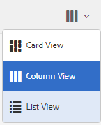

# AEM Assets Brand Portal の新機能 {#what-s-new-in-aem-assets-brand-portal}

Adobe Experience Manager（AEM）Assets Brand Portal では、承認されたクリエイティブアセットを容易に取得、制御し、それらのアセットを、デバイスの種類を問わず、外部の関係者や内部のビジネスユーザーに安全に配布できます。アセットの共有を効率化し、アセットの市場投入までの時間を短縮し、コンプライアンス違反や不正アクセスのリスクを低減できます。アドビは Brand Portal の全体的なエクスペリエンスの強化に取り組んでいます。以下に、最新機能と機能強化について簡単に紹介します。

## 2020.10.0 の変更点 {#what-changed-in-oct-2020}

Brand Portal 2020.10.0は、アセットのダウンロード操作の簡素化に重点を置いた機能強化リリースで、重要な修正が含まれています。 この機能強化には、アセットのダウンロードの新しい強化されたワークフロー、レンディションを除外するオプション、レンディション **** パネルから直接ダウンロードするオプション、特定のユーザーグループのアクセス権とダウンロード権限を許可する設定、すべてのBrand Portalページからのファイル、コレクション、共有リンクへの簡単なナビゲーションが含まれます。 最新の [Brand Portal リリースノート](brand-portal-release-notes.md)を参照してください。

### シンプル化されたダウンロード操作 {#download-dialog}

以前は、複数のアセットやフォルダーをダウンロード用に選択した場合に、技術以外のユーザーや新規ユーザーにとって特にあいまいな、アセットごとに個別のフォルダーを作成、電子メールアセット、オリジナルのアセットを選択、カスタムレンディション、動的レンディションを除外、 **** また、すべてのアセットレンディションを表示したり、特定のカスタムレンディションまたは動的レンディションを除外したりすることはできません。

新しい **[!UICONTROL ダウンロード]** ダイアログでは、アセットの選択とフィルタリング処理が一般化され、Brand Portalユーザーがアセットレンディションのダウンロード中に効果的な判断を行いやすくなります。 これは、「 [**[!UICONTROL ダウンロード]**](brand-portal-download-assets.md) 」設定と「 **[!UICONTROL ダウンロード]** 」設定に応じて、選択したすべてのアセットとそのレンディションをリストします。

<!--
If any of the **[!UICONTROL Custom Rendition]** or **[!UICONTROL System Rendition]** is enabled in the [**[!UICONTROL Download]**](brand-portal-download-assets.md) configuration and **[!UICONTROL Download]** settings are enabled for the group users, the new **[!UICONTROL Download]** dialog appears with all the renditions of the selected assets or folders containing assets in a list view. 
-->

[ **[!UICONTROL ダウンロード]** ]ダイアログでは、次の操作を実行できます。

* ダウンロードリスト内の任意のアセットの使用可能なすべてのレンディションを表示します。
* ダウンロードに必要でないアセットのレンディションを除外します。
* 1回のクリックで、同じレンディションのセットを同じアセットタイプにすべて適用できます。
* アセットタイプごとに異なるレンディションのセットを適用します。
* アセットごとに別のフォルダーを作成.
* 選択したアセットとレンディションをダウンロードします。

ダウンロードワークフローは、スタンドアロンのアセット、複数のアセット、アセットを含むフォルダ、ライセンス済みまたはライセンスされていないアセット、および共有リンクを使用したアセットのダウンロードで常に発生します。

### クイックナビゲーション  {#quick-navigation}

以前は、「表示 **[!UICONTROL ファイル]****[!UICONTROL 」、「]**&#x200B;コレクション **** 」、「共有リンク」の各オプションは非表示になっており、別の表示に切り替えるたびに複数回クリックする必要がありました。

Brand Portal 2020.10.0では、ユーザーはクイックナビゲーションリンクを使用して、すべてのBrand Portalページから **[!UICONTROL ファイル]**、 **[!UICONTROL コレクション]**、 **[!UICONTROL 共有リンク]** (Shared Links)に1回のクリックで移動できます。

### 拡張レンディションパネル {#rendition-panel}

以前は、設定で「 **[!UICONTROL カスタムレンディション]** 」または「 **[!UICONTROL システムレンディション]********** のダウンロード」が有効になっている場合に、元のアセットとそのレンディションのみをレンディションパネルに表示できました。 また、必要のない特定のカスタムレンディションまたは動的レンディションを除外するフィルターがないので、ユーザーはすべてのアセットレンディションをダウンロードする必要がありました。

<!--
Earlier, if any of the custom or system renditions was enabled in the **[!UICONTROL Download]** settings, an additional **[!UICONTROL Download]** dialog appeared on clicking the **[!UICONTROL Download]** button wherein the user had to manually select the set of renditions (original asset, custom renditions, dynamic renditions) to download.
There was no filter to exclude specific custom or dynamic renditions which were not required for download.
-->

Brand Portal 2020.10.0では、ユーザーは、 **[!UICONTROL ダウンロード]** ダイアログを開かずに、特定のレンディションを除外し、アセットの詳細ページのレンディション **** パネルから選択したレンディションを直接ダウンロードできます。

<!-- 
In Brand Portal 2020.10.0, direct download and exclude renditions features are introduced in the **[!UICONTROL Renditions]** panel on the asset details page. All the renditions (original asset, custom renditions, dynamic renditions) under the rendition panel are now associated with a check box and are enabled by default. 

The user can clear the check boxes to exclude the renditions which are not required for download. And can click on the **[!UICONTROL Download]** button in the **[!UICONTROL Renditions]** panel to directly download the selected set of renditions in a zip folder without having to open the **[!UICONTROL Download]** dialog.
-->

### ダウンロード権限の設定 {#download-permissions}

既存の [**[!UICONTROL ダウンロード]**](brand-portal-download-assets.md) 設定に加えて、Brand Portal管理者は、表示に対する様々なグループの権限を設定したり、アセットの詳細ページから元のアセットとそのレンディションをダウンロード（またはその両方）したりできます。 これらの設定により、アセットレンディションにアクセスできるユーザーと、アセットレンディションのダウンロード（またはその両方）が定義されます。

以前は、この設定は、グループユーザーが元のアセットをダウンロードするのを制限する目的でのみ使用できました。

<!-- 
If any of the **[!UICONTROL Custom Rendition]** or **[!UICONTROL System Rendition]** is enabled in the **[!UICONTROL Download]** configuration and **[!UICONTROL Download]** settings are enabled for the group users, then all the renditions of the selected assets or folders containing assets are available to the users for download.
-->

管理者は、 **[!UICONTROL ユーザーの役割]** ( **[!UICONTROL User Roles]** )ページの「グループ」タブで、表示とダウンロードの設定を指定できます。

* 「オリジナルを **[!UICONTROL ダウンロード]** 」と「レンディションを **** ダウンロード」の両方の設定がオンになっている場合、選択したグループのユーザは、オリジナルのアセットとそのレンディションを表示してダウンロードできます。
* 両方の設定をオフにした場合、元のアセットの表示のみが可能です。 アセットのレンディションは、アセットの詳細ページのユーザーには表示されません。
* 「 **[!UICONTROL Download Original]** （オリジナルのダウンロード）」設定のみがオンになっている場合、ユーザはアセットの詳細ページからオリジナルのアセットのみを表示してダウンロードできます。
* 「レンディションを **[!UICONTROL ダウンロード」設定のみが有効になっている場合]** 、ユーザは元のアセットを表示できますが、ダウンロードすることはできません。 ただし、ユーザーはアセットのレンディションを表示してダウンロードできます。

>[!NOTE]
>
>ユーザーが複数のグループに追加され、そのいずれかに制限がある場合、制限がユーザーに適用されます。

<!--
>Restrictions to access the original asset and their renditions do not apply to administrators even if they are members of restricted groups.
 >
 >The users can always download assets and their renditions from the repository using a `curl` request even if the download configurations are turned-off.
 >
-->

## 6.4.7 の変更点 {#what-changed-in-647}

Brand Portal 6.4.7 リリースでは、ドキュメントビューアが導入され、アセットのダウンロードエクスペリエンスが向上し、重要な修正がおこなわれました。最新の [Brand Portal リリースノート](brand-portal-release-notes.md)を参照してください。

<!--
Brand Portal 6.4.7 release brings in the Document Viewer, leverages the Brand Portal administrators to configure asset download, and centers top customer requests. See latest [Brand Portal Release Notes](brand-portal-release-notes.md).
-->

### ドキュメントビューア {#doc-viewer}

ドキュメントビューアを使用すると、PDF の表示操作が向上します。これにより、Adobe Document Cloud が Brand Portal で PDF ファイルを表示する場合と同じようなエクスペリエンスが得られます。

以前は、PDF ファイルの表示には、制限付きのオプションが使用できました。

ドキュメントビューアを使用すると、Brand Portal ユーザーは、ページの表示、ブックマークの表示、ページ上のテキスト検索、ズームイン、ズームアウト、前のページと次のページへの移動、ページの切り替え、ウィンドウに合わせる、画面に合わせる、ツールバーの表示／非表示のオプションが使用できるようになりました。

>[!NOTE]
>
>その他のドキュメント形式の表示方法は変更されません。

### ダウンロードエクスペリエンス {#download-configurations}

アセットのダウンロード処理が改良され、[Brand Portal からアセットをダウンロード](brand-portal-download-assets.md)する際のユーザー操作がシンプルになりました。

Brand Portal からアセットをダウンロードする既存のワークフローでは、必ず&#x200B;**[!UICONTROL ダウンロード]**&#x200B;ダイアログが表示され、その後に複数のダウンロードオプションが表示されます。

Brand Portal 6.4.7 では、Brand Portal 管理者は、アセットの&#x200B;**[!UICONTROL ダウンロード]**&#x200B;設定を設定できます。利用可能な設定は以下の通りです。
* **[!UICONTROL 高速ダウンロード]**
* **[!UICONTROL カスタムレンディション]**
* **[!UICONTROL システムレンディション]**

Brand Portal 管理者は、任意の組み合わせを有効にして、アセットのダウンロードを設定できます。

<!--In Brand Portal 6.4.7, fast download, custom renditions, and system renditions are the three configurations available.-->

* **[!UICONTROL カスタムレンディション]**&#x200B;と&#x200B;**[!UICONTROL システムレンディション]**&#x200B;の両方の設定をオフにした場合、アセットの元のレンディションがダウンロードされますが、追加のダイアログは表示されません。これにより、Brand Portal ユーザーのダウンロード操作が簡易化されます。

* 「**[!UICONTROL カスタムレンディション]**」または「**[!UICONTROL システムレンディション]**」のいずれかが有効な場合は、**[!UICONTROL ダウンロード]**&#x200B;ダイアログが表示され、元のアセットとアセットレンディションがダウンロードされます。「**[!UICONTROL 高速ダウンロード]**」設定を有効にすると、ダウンロード処理が高速になります。

設定に基づき、ダウンロードワークフローは、スタンドアロンのアセット、複数のアセット、アセットを含むフォルダー、ライセンス取得済みアセットまたはライセンスを取得していないアセット、共有リンクを使用してダウンロードするアセットに対して一定に保たれます。

## 6.4.6 の変更点 {#what-changed-in-646}

Brand Portal 6.4.6 では、AEM Assets と Brand Portal の間の認証チャネルが変更されます。Brand Portal が AEM Assets as a Cloud Service、AEM Assets 6.3 以降でサポートされるようになりました。AEM Assets 6.3 以降では、Brand Portal は、従来の OAuth ゲートウェイを通じてクラシック UI で設定されていました。このゲートウェイは、JWT トークン交換を使用して認証用の IMS アクセストークンを取得します。AEM Assets と Brand Portal の連携が、Adobe 開発者コンソールを通じて設定されるようになりました。開発者コンソールが Brand Portal テナントの認証用の IMS トークンを取得します。

<!-- The steps to configure integration are different depending on your AEM version, and whether you are configuring for the first-time, or upgrading the existing integration:
-->

<!--
  
   | **AEM Version** |**New Integration** |**Upgrade Integration** |
|---|---|---|
| **AEM 6.5** |[Create new integration](../using/brand-portal-configure-integration-65.md) |[Upgrade existing integration](../using/brand-portal-configure-integration-65.md#upgrade-integration-65) | 
| **AEM 6.4** |[Create new integration](../using/brand-portal-configure-integration-64.md) |[Upgrade existing integration](../using/brand-portal-configure-integration-64.md#upgrade-integration-64) | 
| **AEM 6.3** |[Create new integration](../using/brand-portal-configure-integration-63.md) |[Upgrade existing integration](../using/brand-portal-configure-integration-63.md#upgrade-integration-63) | 
| **AEM 6.2** |Contact Support |Contact Support | 

   -->

AEM Assets と Brand Portal の連携を設定する手順は、AEM のバージョンと、初めて設定するか既存の設定をアップグレードするかによって異なります。

<!--| **AEM Version** |**New Configuration** |**Upgrade Configuration** |
|---|---|---|
| **AEM 6.5 (6.5.4.0 and above)** |[Create configuration](../using/brand-portal-configure-integration-65.md) |[Upgrade configuration](../using/brand-portal-configure-integration-65.md#upgrade-integration-65) | 
| **AEM 6.4 (6.4.8.0 and above)** |[Create configuration](../using/brand-portal-configure-integration-64.md) |[Upgrade configuration](../using/brand-portal-configure-integration-64.md#upgrade-integration-64) | 
| **AEM 6.3 (6.3.3.8 and above)** |[Create configuration](../using/brand-portal-configure-integration-63.md) |[Upgrade configuration](../using/brand-portal-configure-integration-63.md#upgrade-integration-63) | 
| **AEM 6.2** |Contact Support |Contact Support | 
-->

<!-- AEM Assets configuration with Brand Portal on Adobe I/O is supported on:
* AEM 6.5.4.0 and above
* AEM 6.4.8.0 and above
* AEM 6.3.3.8 and above -->

| **AEM のバージョン** | **新しい設定** | **設定のアップグレード** |
|---|---|---|
| **AEM Assets as a Cloud Service** | [設定の作成](https://docs.adobe.com/content/help/ja-JP/experience-manager-cloud-service/assets/brand-portal/configure-aem-assets-with-brand-portal.html) | - |
| **AEM 6.5（6.5.4.0 以降）** | [設定の作成](https://docs.adobe.com/content/help/ja-JP/experience-manager-65/assets/brandportal/configure-aem-assets-with-brand-portal.html) | [設定のアップグレード](https://docs.adobe.com/content/help/ja-JP/experience-manager-65/assets/brandportal/configure-aem-assets-with-brand-portal.html#upgrade-integration-65) |
| **AEM 6.4（6.4.8.0 以降）** | [設定の作成](https://docs.adobe.com/content/help/ja-JP/experience-manager-64/assets/brandportal/configure-aem-assets-with-brand-portal.html) | [設定のアップグレード](https://docs.adobe.com/content/help/ja-JP/experience-manager-64/assets/brandportal/configure-aem-assets-with-brand-portal.html#upgrade-integration-64) |
| **AEM 6.3（6.3.3.8 以降）** | [設定の作成](https://helpx.adobe.com/jp/experience-manager/6-3/assets/using/brand-portal-configuring-integration.html) | [設定のアップグレード](https://helpx.adobe.com/jp/experience-manager/6-3/assets/using/brand-portal-configuring-integration.html#Upgradeconfiguration) |
| **AEM 6.2** | サポートへのお問い合わせ | サポートへのお問い合わせ |

>[!NOTE]
>
>AEM インスタンスを最新のサービスパックに更新することをお勧めします。

最新の [Brand Portal リリースノート](brand-portal-release-notes.md)を参照してください。

[Brand Portal FAQ](brand-portal-faqs.md) を参照してください。

## 6.4.5 の変更点 {#what-changed-in-645}

Brand Portal 6.4.5 は機能リリースで、オーサー環境にアクセスしなくても Brand Portal ユーザー（外部の代理店／チーム）が Brand Portal にコンテンツをアップロードして AEM Assets に公開できるようにしたものです。この機能は **[Brand Portal でのアセットソーシング](brand-portal-asset-sourcing.md)**&#x200B;と呼ばれます。世界中に分散している他の Brand Portal ユーザーに対するアセットの投稿と共有を実現する双方向メカニズムを提供することで、カスタマーエクスペリエンスを向上させます。

### Brand Portal でのアセットソーシング {#asset-sourcing-in-bp}

アセットソーシングを使用すると、追加の&#x200B;**アセット投稿**&#x200B;プロパティを持つ新しいフォルダーを AEM ユーザー（管理者／管理者以外のユーザー）が作成できるので、この新規作成フォルダーを Brand Portal ユーザーによるアセット送信に利用することができます。これにより、新しく作成された&#x200B;**投稿**&#x200B;フォルダー内に NEW および SHARED という 2 つのサブフォルダーを追加作成するワークフローが自動的にトリガーされます。

次に、AEM ユーザーは要件を定義します。それには、投稿フォルダーに追加する必要があるアセットのタイプの[概要](brand-portal-configure-contribution-folder-properties.md)と[ベースラインアセット](brand-portal-upload-baseline-assets.md)を **SHARED** フォルダーにアップロードして、Brand Portal ユーザーが必要とする参照情報を確実に入手できるようにします。その後、管理者は、アクティブな Brand Portal ユーザーに投稿フォルダーへのアクセスを許可してから、新しく作成した&#x200B;**投稿**&#x200B;フォルダーを Brand Portal に公開することができます。

**NEW** フォルダーへのコンテンツの追加を完了したら、ユーザーは、投稿フォルダーを AEM オーサー環境に公開できます。なお、読み込みが完了し、新しく公開したコンテンツが AEM Assets 内に反映されるまでに数分かかる場合があります。

また、既存の機能はすべてそのままで変わりません。Brand Portal ユーザーは、投稿フォルダーおよび許可された他のフォルダーからアセットを表示、検索およびダウンロードできます。さらに、管理者は投稿フォルダーの共有、プロパティの変更、コレクションへのアセットの追加をおこなうことができます。

>[!NOTE]
>
>Brand Portal のアセットソーシングは、AEM 6.5.2.0 以降でサポートされます。
>
>この機能は、以前のバージョン（AEM 6.3 および AEM 6.4）ではサポートされません。

### 投稿フォルダーへのアセットのアップロード {#upload-assets-in-bp}

適切な権限を持つ Brand Portal ユーザーは、投稿のニーズを理解するために[アセット要件をダウンロード](brand-portal-download-asset-requirements.md)したり、複数のアセットや、複数のアセットを含むフォルダーを投稿フォルダーにアップロードしたりできます。ただし、Brand Portal ユーザーは **NEW** サブフォルダーにのみアセットをアップロードできます。**SHARED** フォルダーは、要件とベースラインアセットを配布するためのものです。[投稿フォルダーへのアセットのアップロード](brand-portal-upload-assets-to-contribution-folder.md)を参照してください。

### AEM Assets への投稿フォルダーの公開 {#publish-assets-to-aem}

**NEW** フォルダーへのアップロードが完了したら、Brand Portal ユーザーは投稿フォルダーを AEM に公開できます。読み込みが完了して公開したコンテンツ／アセットが AEM Assets に反映されるまでに数分かかる場合があります。[AEM Assets への投稿フォルダーの公開](brand-portal-publish-contribution-folder-to-aem-assets.md)を参照してください。

## 6.4.4 の変更点 {#what-changed-in-644}

Brand Portal 6.4.4 リリースでは、テキスト検索の機能強化と、お客様らのご要望への対応に重点を置いています。最新の [Brand Portal リリースノート](brand-portal-release-notes.md)を参照してください。

### 検索の機能強化

Brand Portal 6.4.4 以降では、フィルタリングウィンドウのプロパティの述語で部分テキスト検索がサポートされます。部分テキスト検索を可能にするには、検索フォームの「プロパティの述語」で「**部分検索**」を有効にする必要があります。

部分テキスト検索およびワイルドカード検索について詳しくは、以下の説明を参照してください。

#### 部分フレーズ検索          {#partial-phrase-search}

フィルタリングウィンドウで、検索対象フレーズの一部分（1 つか 2 つの単語）のみを指定してアセットを検索できます。

**使用事例**&#x200B;部分フレーズ検索は、検索対象フレーズに出現する正確な単語の組み合わせが不明な場合に役立ちます。

例えば、Brand Portal の検索フォームで、「プロパティの述語」を使用してアセットのタイトルの部分検索をおこなう場合、「**camp**」という単語を指定すると、タイトルフレーズで「camp」という単語を使用しているアセットがすべて返されます。

#### ワイルドカード検索 {#wildcard-search}

Brand Portal では、検索クエリに、検索対象フレーズの単語の一部とアスタリスク（*）を使用できます。

**使用事例**
検索対象フレーズに出現する正確な単語が不明な場合は、ワイルドカード検索を使用して検索クエリを補完できます。

例えば、Brand Portal の検索フォームで、「プロパティの述語」を使用してアセットのタイトルの部分検索をおこなう場合に、「**climb***」と指定すると、「**climb**」で始まる単語がタイトルフレーズで使用されているアセットがすべて返されます。

さらに、以下のような指定ができます。

* 「***climb**」と指定すると、「**climb**」で終わる単語がタイトルフレーズで使用されているアセットがすべて返されます。

* 「***climb***」と指定すると、「**climb**」という部分文字列を含んだ単語がタイトルフレーズで使用されているアセットがすべて返されます。

>[!NOTE]
>
>「**部分検索**」チェックボックスを選択すると、デフォルトで「**大文字と小文字を区別しない**」がオンになります。

## 6.4.3 の変更点 {#what-changed-in}

Brand Portal 6.4.3 リリースでは、様々な機能が強化されています。具体的には、Brand Portal のアクセス URL にテナント ID だけでなく代替エイリアスを指定できる機能、新しいフォルダー階層の設定、ビデオサポートの機能強化、AEM オーサーインスタンスから Brand Portal への公開の日時指定、運用上の機能強化、顧客リクエストへの対応などがあります。

### 管理者以外のユーザーに表示するフォルダー階層のナビゲーション

管理者以外のユーザー（エディター、閲覧者、ゲストユーザー）がログインしたときにフォルダーをどのように表示するかを管理者が設定できるようになりました。管理ツールパネルの&#x200B;**一般設定**&#x200B;に「[フォルダー階層を有効化](../using/brand-portal-general-configuration.md)」設定が追加されています。この設定は次のように動作します。

* **有効**&#x200B;にした場合は、ルートフォルダーから始まるフォルダーツリーが管理者以外のユーザーに表示されます。これにより、管理者と同じようなナビゲーション体験を提供できます。
* **無効**&#x200B;にした場合は、共有フォルダーのみランディングページに表示されます。

「[フォルダー階層を有効化](../using/brand-portal-general-configuration.md)」の機能は（有効にした場合）、別の階層から共有されている同名のフォルダーを区別するために役立ちます。管理者以外のユーザーがログインすると、共有フォルダーの仮想親フォルダー（とその上位層）が表示されます。

共有フォルダーは、仮想フォルダー内のそれぞれのディレクトリ内で整理されます。仮想フォルダーは鍵のアイコン付きで表示されます。

仮想フォルダーのデフォルトのサムネールは最初の共有フォルダーのサムネール画像になることに注意してください。

### 特定のフォルダー階層またはパス内での検索

検索フォームに&#x200B;**パスブラウザー**&#x200B;の述語が導入され、特定のディレクトリ内でアセットを検索できるようになりました。パスブラウザーの検索用述語のデフォルトの検索パスは `/content/dam/mac/<tenant-id>/` です。これはデフォルトの検索フォームを編集することで設定できます。

* 管理者は、パスブラウザーを使用して、Brand Portal 上の任意のフォルダーディレクトリへ移動できます。
* 管理者以外のユーザーは、パスブラウザーを使用して、自身に共有されているフォルダーへのみ移動できます（さらに、その親フォルダーへと階層をさかのぼることができます）。

   例えば、`/content/dam/mac/<tenant-id>/folderA/folderB/folderC` が管理者以外のユーザーと共有されているとします。このユーザーは、パスブラウザーを使用して、folderC 内のアセットを検索できます。このユーザーは、folderB や folderA に移動することもできます（ユーザーと共有されている folderC の上位層だからです）。

ルートフォルダーから始まる階層ではなく、参照した特定のフォルダー内でのみアセットを検索することができます。

これらのフォルダーで検索をおこなうと、ユーザーに共有されているアセットの中で検索した結果が返されることに注意してください。

### Dynamic Media ビデオレンディションのサポート

Dynamic Media ハイブリッドモードの AEM オーサーインスタンスを使用しているユーザーは、オリジナルのビデオファイルに加えて、Dynamic Media レンディションをプレビューしたりダウンロードしたりできます。

特定のテナントアカウントでダイナミックメディアレンディションのプレビューおよびダウンロードができるようにするには、管理者が管理ツールパネルの&#x200B;**ビデオ**&#x200B;設定で **Dynamic Media 設定**（ダイナミックビデオを取得するためのビデオサービスの URL（Dynamic Media ゲートウェイの URL）と登録 ID）を指定する必要があります。

Dynamic Media ビデオは以下の場所でプレビューできます。

* アセットの詳細ページ
* アセットのカード表示
* リンク共有のプレビューページ

Dynamic Media ビデオエンコードは以下の場所からダウンロードできます。

* Brand Portal
* 共有リンク

### Brand Portal への公開のスケジュール設定

[AEM（6.4.2.0）](https://helpx.adobe.com/jp/experience-manager/6-4/release-notes/sp-release-notes.html#main-pars_header_9658011)オーサーインスタンスから Brand Portal へのアセット（およびフォルダー）公開ワークフローのスケジュールに未来の日時を指定できるようになりました。

同様に、「Brand Portal で非公開」ワークフローのスケジュールを設定することで、公開されているアセットを未来の特定の日時にポータルから取り下げることができます。

### URL 中の設定可能なテナントエイリアス

組織のポータル URL に代替プレフィックスを含めて、カスタマイズされたポータル URL を取得することができます。既存のポータル URL 中のテナント名のエイリアスを取得するには、各組織からアドビサポートへ依頼する必要があります。

カスタマイズできるのは Brand Portal URL のプレフィックスのみであり、URL 全体でないことに注意してください。\
例えば、**geomettrix.brand-portal.adobe.com** という既存ドメインを持つ組織は、アドビに依頼することで **geomettrixinc.brand-portal.adobe.com** という URL を作成できます。

ただし、AEM オーサーインスタンスを[設定](https://helpx.adobe.com/jp/experience-manager/6-5/assets/using/brand-portal-configuring-integration.html)する際にはテナント ID URL のみを使用できます。テナントエイリアス（代替）URL は使用できません。

アドビから提供された URL をそのまま使用するのではなく、カスタマイズされたポータル URL を取得して、ブランドのニーズを満たすことができます。

### ダウンロードエクスペリエンスの強化

このリリースでは、以下の状況におけるクリックや警告の数を低減し、シンプルなダウンロードエクスペリエンスを実現しています。

* レンディションのみ（元のアセットはダウンロードしない）をダウンロードするようにオプトする。
* 元のレンディションへのアクセス時のアセットのダウンロードは制限されます。

## 6.4.2 の変更点 {#what-changed-in-1}

Brand Portal 6.4.2 リリースでは、組織のアセット配布のニーズを解決し、高速ダウンロードを使用した最適なエクスペリエンスとゲストによるアクセスを通じて組織が世界中に分散されている多数のユーザーに到達できるようサポートする、様々な機能を取り入れています。また、Brand Portal は、管理者向けの新しい設定や新しく追加されたレポートを通じてきめ細かな制御を実現し、お客様の要求に応じます。

### ゲストによるアクセス

AEM Brand Portal は、ゲストによるポータルへのアクセスを許可します。ゲストユーザーは資格情報がなくてもポータルに入ることができます。また、すべての公開フォルダーおよび公開コレクションにアクセスしたり、それらをダウンロードしたりすることができます。ゲストユーザーは Lightbox（非公開コレクション）にアセットを追加したり、Lightbox からアセットをダウンロードしたりすることができます。また、管理者によって定められたスマートタグ検索や検索用述語を表示することもできます。ゲストセッションでは、ユーザーはコレクションや保存済みの検索を作成または共有したり、フォルダーやコレクションの設定にアクセスしたり、アセットをリンクとして共有したりすることはできません。

組織では、複数の同時ゲストセッションが許可されます（同時ゲストセッションの数は、組織あたりの合計ユーザークォータの 10 ％に制限されます）。

ゲストセッションは 2 時間アクティブのままになります。そのため、Lightbox の状態も、セッション開始時刻から 2 時間保持されます。2 時間後、ゲストセッションは再起動する必要があるので、Lightbox の状態も失われます。

### ダウンロードの高速化

Brand Portal ユーザーは、最大 25 倍の速度を実現できる IBM Aspera Connect の高速ダウンロードを利用して、世界中のどこにいてもシームレスにダウンロードをおこなうことができます。Brand Portal または共有リンクからアセットを高速にダウンロードするには、ダウンロードダイアログで「**ダウンロードアクセラレーションを有効化**」オプションを選択する必要があります（その組織で高速ダウンロードが有効になっていることが前提です）。

その組織で IBM Aspera による高速ダウンロードを有効にするには、管理者が、管理ツールパネルの[一般設定](brand-portal-general-configuration.md#allow-download-acceleration)の「**ダウンロードアクセラレーションを有効化**」オプション（デフォルトでは無効になっています）を有効にします。Brand Portal および共有リンクからのアセットファイルのダウンロードを高速化するための前提条件とトラブルシューティング手順について詳しくは、[Brand Portal からのダウンロードを高速化するためのガイド](../using/accelerated-download.md#main-pars-header)を参照してください。

### ユーザーログインレポート

ユーザーのログインを追跡するための新しいレポートが導入されました。**ユーザーログイン**&#x200B;レポートは、組織が Brand Portal の委任管理者やその他のユーザーを監査および監視するし、目を光らせるのに便利です。

レポートログには、Brand Portal 6.4.2 を導入してからレポート生成時までの各ユーザーの名前、電子メール ID、ペルソナ（管理者、閲覧者、エディター、ゲスト）、グループ、最後のログイン、アクティビティのステータス、およびログイン回数が表示されます。管理者は、レポートを .csv 形式で書き出すことができます。ユーザーログインレポートを他のレポートと併用すれば、組織はユーザーによる承認済みのブランドリソースの操作をより厳しく監視できるので、企業コンプライアンスオフィスへの適合性を確保することができます。

### オリジナルのレンディションへのアクセス

管理者が、オリジナルの画像ファイル（.jpeg、.tiff、.png、.bmp、.gif、.pjpeg、x-portable-anymap、x-portable-bitmap、x-portable-graymap、x-portable-pixmap、x-rgb、x-xbitmap、x-xpixmap、x-icon、image/photoshop、image/x-photoshop、.psd、image/vnd.adobe.photoshop）へのユーザーアクセスを制限する一方で、Brand Portal または共有リンクからダウンロード可能な低解像度のレンディションへのアクセスを許可することができます。このアクセス権は、管理ツールパネルのユーザーの役割ページの「グループ」タブからユーザーグループレベルで制御できます。

* デフォルトでは、「オリジナルへのアクセス」がすべてに対して有効になっているので、すべてのユーザーがオリジナルのレンディションをダウンロードできます。
* ユーザーのグループがオリジナルのレンディションにアクセスできないようにするには、管理者は各チェックボックスを選択解除する必要があります。
* ユーザーが複数のグループのメンバーであり、グループのひとつのみに制約がある場合、制約はそのユーザーに適用されます。
* 制約は管理者には適用されません（管理者が制約されたメンバーである場合を含む）。
* リンクとしてアセットを共有するユーザーの権限は、共有リンクを使用してアセットをダウンロードするユーザーに適用されます。

### カード表示およびリスト表示のフォルダー階層パス

カード表示のときに、フォルダーのカードが、管理者以外のユーザー（エディター、閲覧者、ゲストユーザー）向けにフォルダー階層情報を表示するようになりました。この機能は、親階層について、アクセスしようとしているフォルダーの場所をユーザーに知らせます。

フォルダー階層情報は特に、似たような名前のフォルダーを、別のフォルダー階層から共有された他のフォルダーと区別する際に便利です。管理者以外のユーザーが、自分たちに共有されているアセットのフォルダー構造を把握していない場合、似たような名前のアセット／フォルダーは紛らわしくなります。

* それぞれのカードに表示されるパスは、カードのサイズに合わせて切り詰めて表示されます。ただし、ユーザーが切り詰められたパスにカーソルを合わせると、完全なパスをツールヒントとして表示することができます。

リスト表示では、Brand Portal のすべてのユーザーに対し、列内のアセットのフォルダーパスを示します。

### アセットのプロパティを表示する「概要」オプション

Brand Portal には、選択したアセット／フォルダーのアセットプロパティを管理者以外のユーザー（エディター、閲覧者、ゲストユーザー）が表示できる「概要」オプションがあります。「概要」オプションは、次の場所に表示されます。

1. アセットやフォルダーを選択する際に上部に表示されるツールバー。
2. パネルセレクターを選択する際のドロップダウン。

アセットやフォルダーを選択した状態で「概要」オプションを選択すると、タイトル、パス、アセット作成時間を確認できます。一方、アセットの詳細ページで「概要」オプションを選択すると、アセットのメタデータを確認できます。

## 新しい設定

管理者が特定のテナントで次の機能を有効化／無効化できるよう、6 つの新しい設定が追加されました。

* ゲストによるアクセスを許可
* ユーザーによる Brand Portal へのアクセス要求を許可
* 管理者が Brand Portal からアセットを削除することを許可
* 公開コレクションの作成を許可
* 公開スマートコレクションの作成を許可
* ダウンロードアクセラレーションを許可

上記の設定は、管理ツールパネルのアクセスおよび一般設定にあります。

### Adobe I/O UI による OAuth 統合の設定

Brand Portal 6.4.2 以降では、Adobe.io [https://legacy-oauth.cloud.adobe.io/](https://legacy-oauth.cloud.adobe.io/) インターフェイスを使用して JWT アプリケーションを作成しています。このアプリケーションでは、AEM Assets と Brand Portal の統合を許可するように OAuth 統合を設定できます。OAuth 統合を設定するための UI は、以前、`https://marketing.adobe.com/developer/` / でホストされていました。Brand Portal にアセットとコレクションを公開するための、AEM Assets と Brand Portal の統合について詳しくは、[AEM Assets と Brand Portal の統合の設定](https://docs.adobe.com/content/help/ja-JP/experience-manager-64/assets/brandportal/configure-aem-assets-with-brand-portal.html)を参照してください。

## 検索の機能強化

プロパティの述語で大文字と小文字を区別しないように設定できます。それには、更新されたプロパティの述語にある「大文字と小文字を区別しない」をオンにします。このオプションは、プロパティの述語と複数値プロパティの述語で使用できます。\
ただし、大文字と小文字を区別しない検索では、プロパティの述語のデフォルト検索よりも時間がかかります。検索フィルターに大文字と小文字を区別しない述語が多数ある場合は、検索に時間がかかることがあります。そのため、大文字と小文字を区別しない検索は、慎重に使用することをお勧めします。

## 6.4.1 の変更点 {#what-changed-in-2}

Brand Portal 6.4.1 はプラットフォームのアップグレードリリースであり、より充実した顧客エクスペリエンスを実現するために、いくつかの新機能と、閲覧、検索、パフォーマンスなどの重要な機能強化を提供します。

### 閲覧の機能強化

* 新しいコンテンツツリーレールでアセット階層内をすばやく移動できるようになりました。

* 新しいキーボードショートカットが追加されました。例えば、プロパティページへの移動には _P_ キー、編集には _E_ キー、コピー操作には _Ctrl+C_ キーを使用します。
* 多数のアセットの閲覧に対応するように、カードおよびリスト表示でのスクロールが改善され、遅延読み込みがおこなわれるようになりました。
* カード表示の機能が強化され、表示設定に基づいて様々なサイズのカードがサポートされるようになりました。

* カード表示で日付ラベルにマウスポインターを置くと、日時が表示されるようになりました。

* アセットのスナップショットの下に「**詳細情報**」が追加され、アセットの詳細ページに移動できるようになりました。

* リスト表示の 1 列目にデフォルトでアセットのファイル名が表示されるようになりました。この他、ロケール、アセットタイプ、寸法、サイズ、評価および公開情報も表示されます。新しい「**設定を表示**」を使用して、リスト表示に表示する詳細情報を設定できるようになりました。

* アセットの詳細が強化され、新しいナビゲーションボタンを使用してアセット間を行き来し、アセット数を表示できるようになりました。

* AEM からアップロードされたオーディオファイルをアセットの詳細ページでプレビューできるようになりました。
* アセットのプロパティに新しい関連アセット機能が追加されました。AEM の他のソースや派生アセットと関連し、Brand Portal で公開されるアセットが、Brand Portal 内でもその関連性を維持するようになりました（プロパティページに関連アセットへのリンクが含まれます）。
* 管理者以外のユーザーによる公開コレクションの作成を制限する新しい設定が追加されました。各組織はアドビサポートチームと連携して、この機能を特定のアカウントに設定することができます。

### 検索の機能強化

* 検索項目に移動した後に、検索クエリを再度実行しなくても検索結果内の同じ位置に戻れる機能が追加されました。
* 検索結果数が表示されるようになりました。
* ファイルタイプによる検索フィルターが強化され、以前の「画像」、「ドキュメント」、「マルチメディア」などのオプションではなく、.jpg、.png、.psd などの詳細な MIME タイプに基づいてきめ細かくフィルター処理できるようになりました。
* コレクションの検索フィルターが強化され、以前の時間スライダー機能ではなく、正確なタイムスタンプで処理できるようになりました。
* 新しいアクセスタイプフィルターが追加され、公開または非公開コレクションを検索できるようになりました。

### ダウンロードの最適化

* サイズが大きい単一のファイルを、zip ファイルを作成しなくても直接ダウンロードできるようになり、処理速度とスループットが向上しました。
* リンク共有機能の Zip ダウンロード制限が 1 GB から 5 GB に増えました。

* アセットを Brand Portal から、または共有リンク機能を利用してダウンロードするときに、カスタムファイルと元のファイルのみを選択してダウンロードし、既製のレンディションのダウンロードを避けることができるようになりました。

### パフォーマンスの強化

* アセットのダウンロード速度が最大 100％向上しました。
* アセットの検索応答が最大 40％向上しました。
* 閲覧パフォーマンスが最大 40％向上しました。

**注意**：ここに記した向上率は、ラボテスト実施時点でのものです。

### レポート機能の強化

**リンク共有レポートの追加**

共有リンクの情報を提供する新しいレポートが追加されました。リンク共有レポートには、指定期間内に組織全体にわたって内部および外部のユーザーと共有されるすべてのアセットへの URL が示されます。さらに、リンクがいつ共有されたか、誰と共有されたか、いつ期限が切れるかという情報も示されます。

**使用状況レポートへのアクセスエントリポイントの変更**

使用状況レポートは他のレポートと統合され、アセットレポートコンソールから表示できるようになりました。アセットレポートコンソールにアクセスするには、管理ツールパネルから、**レポートを作成／管理**&#x200B;を選択します。

**レポート作成のユーザーエクスペリエンスの向上**
Brand Portal のレポートインターフェイスが、より直観的に使用できるようになり、きめ細かな制御が可能になりました。レポートは Brand Portal に保存されるので、管理者は、各種レポートを作成できる以外にも、生成済みレポートに再アクセスし、それらをダウンロードまたは削除できます。

デフォルトの列を追加または削除することで、各レポートを作成中にカスタマイズできるようになりました。また、ダウンロード、有効期限および公開レポートにカスタム列を追加して、精度を制御することもできます。

### 管理ツールの強化

メタデータ、検索およびレポートの管理ツールに用意されているプロパティピッカーが強化され、オートコンプリート機能や閲覧機能により管理操作が簡単になりました。

### その他の機能強化

* AEM Assets Brand Portal レプリケーションダイアログの「公開フォルダーの公開」チェックボックスをオンにすると、AEM 6.3.2.1 および 6.4 から Brand Portal に公開されるアセットが Brand Portal の一般ユーザーにも利用可能になります。

* Brand Portal へのアクセス権が申請されると、Brand Portal の通知領域に通知が届くほか、アクセス権の申請があったことを知らせる電子メールが管理者に送信されます。

## 6.3.2 の変更点 {#what-changed-in-3}

Brand Portal 6.3.2 は、顧客からの強い要望に応える新機能や拡張機能と、全般的なパフォーマンス向上を提供します。

### Brand Portal へのアクセス権の申請 {#request-access-to-brand-portal}

ユーザーは、Brand Portal のログイン画面に「**アクセスが必要ですか？**」と表示される新機能を使用して、Brand Portal へのアクセスを申請できるようになりました。

Adobe ID を持っている場合と、Adobe ID を作成する必要がある場合のそれぞれに応じて、適切なワークフローに従って申請を送信できます。Brand Portal の製品管理者は、ユーザーからの申請が通知領域に届いたら、Adobe Admin Console からアクセスを付与します。

詳しくは、[Brand Portal へのアクセス権の申請](../using/brand-portal.md#requestaccesstobrandportal)を参照してください。

### ダウンロードされたアセットのレポートの機能強化 {#enhancement-in-the-assets-downloaded-report}

ダウンロードされたアセットのレポートに、指定期間中のユーザー別のアセットダウンロード回数が含まれるようになりました。このレポートを .csv 形式でダウンロードすると、ライセンスが必要なアセットの合計ダウンロード数などのデータを集計できます。

詳しくは、[追加レポートの作成と管理](../using/brand-portal-reports.md#createandmanageadditionalreports)の手順 3 および 6 を参照してください。

### Brand Portal のメンテナンス通知 {#brand-portal-maintenance-notification}

次回のメンテナンス作業の 2～3 日前に通知バナーが表示されるようになりました。以下に通知の例を示します。

詳しくは、[Brand Portal のメンテナンス通知](https://helpx.adobe.com/jp/experience-manager/brand-portal/using/brand-portal.html#BrandPortalmaintenancenotification)を参照してください。

### リンク共有機能で共有される要ライセンスアセットの機能強化 {#enhancement-for-licensed-assets-shared-using-the-link-share-feature}

ライセンスが必要なアセットをリンク共有機能でダウンロードするときに、そのアセットの使用許諾契約書への同意が求められるようになりました。

詳しくは、[アセットをリンクとして共有](../using/brand-portal-link-share.md#shareassetsasalink)の手順 12 を参照してください。

### ユーザーピッカーの機能強化 {#user-picker-enhancement}

ユーザーピッカーのパフォーマンスが向上し、ユーザーを膨大に抱える顧客のニーズに対応できるようになりました。

### Adobe Experience Cloud ブランディングの変更 {#experience-cloud-branding-changes}

Brand Portal は、新しい Adobe Experience Cloud ブランディングに準拠するようになりました。

## 6.3.1 の変更点 {#what-changed-in-4}

Brand Portal 6.3.1 は、Brand Portal と AEM の統合に向けた新機能と拡張機能を含みます。

### ユーザーインターフェイスのアップグレード {#upgraded-user-interface}

現在、Brand Portal のユーザーエクスペリエンスを AEM と統合するために、Coral 3 ユーザーインターフェイスへの移行を進めています。この変更により、ナビゲーションや外観を含む全体的な操作性が向上します。

#### ナビゲーションの強化 {#enhanced-navigational-experience}

* 以下に示す新しいアドビロゴから、管理ツールにすばやくアクセスできます。

* オーバーレイから製品のナビゲーションができます。

* 親フォルダーにすばやく移動できます。

* 必要なコンテンツとツールをすばやく検索して移動できます。

### 閲覧の強化 {#enhanced-browsing-experience}

* 新しい列表示で、ネストされたフォルダーを参照できます。

 

* アップロードされた最新のアセットは、フォルダー内のアセットの一覧の一番上に表示されます。

### 検索の強化 {#enhanced-search-experience}

* 新しいオムニサーチ機能により、検索キーワードを入力すると自動的に検索候補が表示されるので、その中から関連するコンテンツや機能、タグにすばやくアクセスできます。オムニサーチは、すべての検索機能で使用できます。

* オムニサーチに検索フィルターを追加すれば、検索結果をより細かく絞り込んで、検索を効率化できます。

* 新しい評価ベースのアセット検索を使用すると、アセットを評価に基づいて検索できます（AEM Assets から公開されている場合）。
* 新しい複数値検索では、AND 演算子で複数のキーワードを指定して、アセットをすばやく検出できます。
* 新しい検索ブースト機能を使用すると、検索関連性を向上させて、特定のアセットを検索結果の一番上に表示できます。
* 新しいパスベースの検索機能を使用すると、アセットを検索できるネストされたフォルダーへのパスが見つかります。

#### 新しいスマートタグベースの検索 {#new-smart-tags-based-search}

スマートタグ付きの画像が AEM Assets から Brand Portal に公開されている場合は、Brand Portal 内で、スマートタグの名前を検索キーワードとして使用して、これらの画像を検索できます。この機能は、ファイルに対してのみ使用できます。

### ダウンロードの強化 {#enhanced-downloading-experience}

ネストされたフォルダーをダウンロードした後も、元のフォルダー階層を保持できます。ネストされたフォルダー内のアセットを、それぞれのフォルダーではなく、単一のフォルダーにダウンロードすることも可能です。

### パフォーマンスの向上 {#improved-performance}

参照、検索およびダウンロード機能が強化され、Brand Portal のパフォーマンスが大幅に向上しています。

### アセットの新しい Digital Rights Management {#new-digital-rights-management-for-assets}

管理者は、アセットを共有する前に、そのアセットの有効期限（日時）を設定できます。有効期限が切れたアセットは、閲覧者とエディターが見ることはできますが、ダウンロードはできません。アセットの有効期限が切れると、管理者に通知されます。

### アセットの並べ替えの強化 {#enhanced-asset-sorting}

リスト表示でのフォルダー内アセットの並べ替えを、最初のページに表示されるアセットの数に関係なく実行できるようになりました。フォルダー内のすべてのアセットが最初のページに表示されるかどうかに関係なく、すべてのアセットが並べ替えられます。

### レポート機能の強化 {#reporting-capabilities}

管理者は、アセットのダウンロード、期限切れ、公開に関する 3 種類のレポートを作成および管理できます。レポート内に列を設定したり、レポートを CSV 形式で書き出したりすることも可能です。

### 追加のメタデータ {#additional-metadata}

Brand Portal 6.3.1 には、AEM Assets 6.3 と同じメタデータが追加されています。スキーマエディターフォームを使用して、アセットのプロパティページに表示するメタデータを制御できます。アセットメタデータは、外部のリンク共有ユーザーには表示されません。これらのユーザーは、リンク共有 URL を使用して、アセットのプレビューとダウンロードのみおこなえます。

### 管理者用機能の追加 {#additional-capabilities-for-administrators}

* 管理者は、ログイン画面の壁紙のカスタマイズを最終決定する前に、変更内容をプレビューできます。

* 管理者が追加する新しいユーザーは、Brand Portal に自動的に追加されるので、Brand Portal への招待に同意する必要はありません。

### AEM Assets 6.3 の新しい公開機能 {#new-publishing-capabilities-in-aem-assets}

* AEM 管理者は、2017 年 Q4 に提供される AEM 6.3 SP 1-CFP 1（6.3.1.1）を使用して、AEM Assets から Brand Portal にメタデータスキーマを公開できます。

* AEM 管理者は、AEM 6.2 SP1-CFP7 と AEM 6.3 SP 1-CFP 1（6.3.1.1）を使用して、AEM Assets から Brand Portal にすべてのタグを公開できます。

* AEM Assets から、タグ（スマートタグを含む）を持つアセットとコレクションを公開できます。その後、Brand Portal 内でこれらのタグを検索キーワードとして使用して、アセットやコレクションを検索できます。
